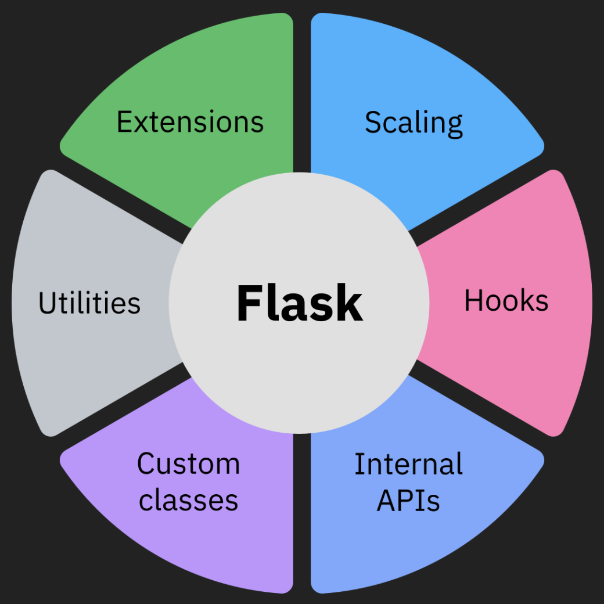

# Python with Flask for Large-Scale Projects

## Introduction

Python with Flask is a lightweight and flexible web application framework. It's known for its simplicity, minimalism, and ease of use.

Flask is designed as a micro-framework providing a lightweight structure that facilitates developers in building web applications quickly and easily without compromising on efficiency and the ability to scale up from small-scale projects to larger, more complex applications.

## Flask for Large-Scale Development

### Is Flask Suitable for Large-Scale Applications?

Flask is a good choice for smaller, simpler applications. However, the term "micro" has more to do with what Flask is, rather than limiting its scalability potential.

Flask **can be used** for large-scale systems and more complex applications with:
- Attention to specific requirements and constraints
- Careful planning
- Good architecture
- Modular design

**Note:** Flask may require more effort to manage and scale compared to more robust and feature-rich frameworks.

### Flask's Ecosystem Advantage

Flask's rich and robust ecosystem provides developers with tools, libraries, and functionalities to handle web development tasks such as:
- Routing
- Request handling
- Template rendering
- Similar web development tasks

To achieve optimal results in large-scale projects, consider implementing:
- **Caching** - to improve performance
- **Load-balancing** - to distribute traffic
- **Replication** - for redundancy
- **Scalable data storage** - to manage growing data needs

## Key Flask Capabilities for Large-Scale Development

When building a large-scale application using Flask or when growing your codebase and scaling your application, the following techniques can be considered:

*Flask's key capabilities for large-scale development: Extensions, Scaling, Hooks, Internal APIs, Custom classes, and Utilities*

### Extensibility and Integration

Flask is extensible and developers can add or remove features enabling customization. Flask seamlessly integrates with other Python libraries and frameworks, enabling developers to:
- Combine its functionalities with other tools and technologies
- Enhance its capabilities
- Build a custom tech stack

### Transparent Documentation

Flask's documentation is published and accessible, allowing developers to:
- Use its internal APIs and utilities
- Find hook points, overrides, and signals as per requirement
- Understand the framework at a deeper level

### Custom Implementation

Out-of-the-box customizations and custom classes can be used for things like the request and response objects. The Flask class has many methods designed for subclassing. You can quickly add or customize behavior by:
- Subclassing Flask
- Using that subclass wherever you instantiate an application class
- Creating custom request/response handling

### Scaling Considerations

Flask supports linear scaling with some important constraints:

**Linear Scaling Model**
- If you double the number of servers, you get approximately twice the performance
- Enables horizontal scaling for performance improvement

**Important Limitation**
There is one limiting factor regarding scaling in Flask: the use of **context local proxies**. They depend on context which in Flask is defined as being either a thread, process, or greenlet.

If your server uses some kind of concurrency that is not based on threads or greenlets, Flask will no longer be able to support these global proxies. Consider this when choosing your concurrency model.

### Modular Development

To build scalable applications, look for ways in which your project can be refactored into:
- A collection of utilities
- Flask extensions
- Reusable components

**Best Practices:**
- Explore the many extensions in the community
- Look for patterns to build your own extensions if you don't find the tools you need
- Get feedback from users to improve tools for larger applications
- Build for modularity from the start

## Real-World Applications

### Flask Adoption in Industry

Today, Python with Flask has become a popular choice among major companies for its:
- Simplicity
- Flexibility
- Versatility
- Ease of learning and use
- Minimalistic and customizable design

### Companies Using Flask

Several prominent companies leverage Python with Flask in their technology stacks for specific backend services or functionalities:
- **Netflix**
- **Reddit**
- **Lyft**
- **LinkedIn**
- **Pinterest**
- **Uber**

### Use Cases and Benefits

Python Flask benefits big companies for diverse purposes such as:
- **API development** - Building robust RESTful APIs
- **Backend services** - Supporting core functionality
- **Rapid development** - Quick prototyping and iteration
- **Prototyping** - Testing ideas quickly
- **Extensibility** - Adding functionalities within their infrastructure

### Conclusion on Flask's Scalability

The adoption by major tech companies suggests that Flask **can be part of scalable architectures** when combined with:
- Appropriate strategies
- Well-designed architecture
- Supporting tools and technologies
- Proper infrastructure planning
- Modular coding practices

This demonstrates that Flask's "micro" designation does not limit its ability to power large, complex applications in production environments.
