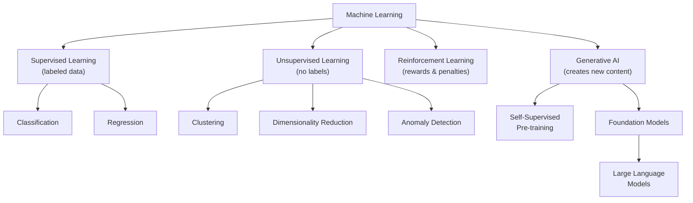
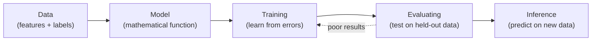
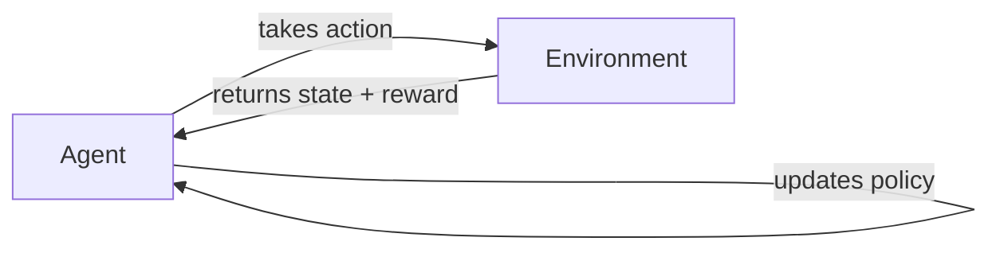
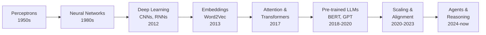
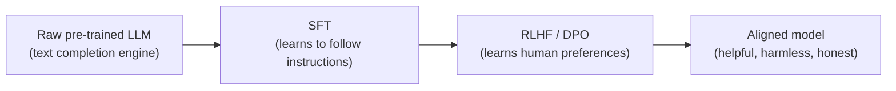
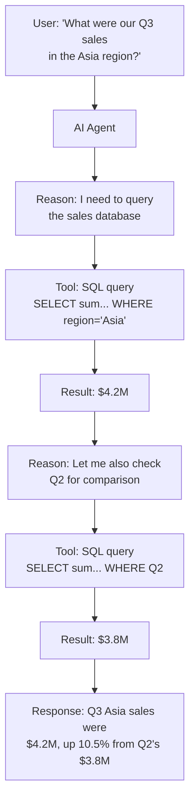

# The Beginner's Foundations: From Data to LLMs

> A structured guide for AI/ML founding engineers who want to understand what's actually happening under the hood — not just use the API.

---

## Table of Contents

- [Introduction](#introduction)
  - [What Is Machine Learning?](#what-is-machine-learning)
  - [Types of Machine Learning Systems](#types-of-machine-learning-systems)
- [Core Concepts](#core-concepts)
  - [1. Supervised vs. Unsupervised Learning](#1-supervised-vs-unsupervised-learning)
    - [The Core Distinction](#the-core-distinction)
    - [Supervised Learning — In Depth](#supervised-learning--in-depth)
    - [Unsupervised Learning — In Depth](#unsupervised-learning--in-depth)
  - [2. Reinforcement Learning](#2-reinforcement-learning)
  - [3. Generative AI](#3-generative-ai)
    - [Input-to-Output Types](#input-to-output-types)
    - [How Does Generative AI Work?](#how-does-generative-ai-work)
  - [4. Self-Supervised Learning — The Bridge](#4-self-supervised-learning--the-bridge)
  - [5. Foundation Models](#5-foundation-models)
    - [What Is a Foundation Model?](#what-is-a-foundation-model)
    - [The "Before and After"](#the-before-and-after)
    - [How Adaptation Works](#how-adaptation-works)
    - [A Note on Terminology Honesty](#a-note-on-terminology-honesty)
  - [6. Large Language Models (LLMs)](#6-large-language-models-llms)
    - [What Makes an LLM Different from Traditional ML?](#what-makes-an-llm-different-from-traditional-ml)
    - [The Training Objective: Why "Predict the Next Token" Is So Powerful](#the-training-objective-why-predict-the-next-token-is-so-powerful)
    - [The Transformer — The Architecture That Made This Possible](#the-transformer--the-architecture-that-made-this-possible)
    - [Emergent Capabilities](#emergent-capabilities)
  - [7. Tokens — How Models Actually "Read"](#7-tokens--how-models-actually-read)
    - [Why Not Just Use Words?](#why-not-just-use-words)
    - [What Is a Token?](#what-is-a-token)
    - [How Tokenizers Are Built — Byte-Pair Encoding (BPE)](#how-tokenizers-are-built--byte-pair-encoding-bpe)
    - [Token ≠ Word — The Numbers](#token--word--the-numbers)
    - [Why Tokens Matter to You as a Founder](#why-tokens-matter-to-you-as-a-founder)
- [The AI/ML Landscape: Every Term You'll Encounter](#the-aiml-landscape-every-term-youll-encounter)
  - [Act 1: Neural Networks — The Building Blocks](#act-1-neural-networks--the-building-blocks)
  - [Act 2: Specialized Architectures — The Right Tool for Each Data Type](#act-2-specialized-architectures--the-right-tool-for-each-data-type)
  - [Act 3: Embeddings — Teaching Machines What Words Mean](#act-3-embeddings--teaching-machines-what-words-mean)
  - [Act 4: The Transformer Revolution](#act-4-the-transformer-revolution)
  - [Act 5: Scaling — Bigger Models, Better Results](#act-5-scaling--bigger-models-better-results)
  - [Act 6: Alignment — Making Models Actually Helpful](#act-6-alignment--making-models-actually-helpful)
  - [Act 7: Efficiency — Running Powerful Models Cheaply](#act-7-efficiency--running-powerful-models-cheaply)
  - [Act 8: Trustworthiness — When the Model Gets It Wrong](#act-8-trustworthiness--when-the-model-gets-it-wrong)
  - [Act 9: Generation Controls — Tuning the Output](#act-9-generation-controls--tuning-the-output)
  - [Act 10: Beyond Text — Multimodal & Image Generation](#act-10-beyond-text--multimodal--image-generation)
  - [Act 11: The Frontier — Agents, Reasoning & Tool Use](#act-11-the-frontier--agents-reasoning--tool-use)
  - [Act 12: The Business Layer — Shipping AI in Production](#act-12-the-business-layer--shipping-ai-in-production)
- [Glossary](#glossary)
  - [Foundational Concepts](#foundational-concepts)
  - [Neural Networks & Deep Learning](#neural-networks--deep-learning)
  - [Parameters & Training](#parameters--training)
  - [Embeddings & Representations](#embeddings--representations)
  - [Transformer Architecture](#transformer-architecture)
  - [Foundation Models & LLMs](#foundation-models--llms)
  - [Alignment & Safety](#alignment--safety)
  - [Efficiency & Optimization](#efficiency--optimization)
  - [Generation Controls](#generation-controls)
  - [Multimodal & Image Generation](#multimodal--image-generation)
  - [Agents, Reasoning & Tools](#agents-reasoning--tools)
  - [Business & Production](#business--production)
- [Success Criteria Self-Check](#success-criteria-self-check)
  - [Essential Definitions](#essential-definitions)
  - [Foundations](#foundations)
  - [Landscape](#landscape)

---


## Introduction

### What Is Machine Learning?

Machine learning is the process of training a piece of software — called a **model** — to make useful predictions or generate content from data. Instead of writing explicit rules ("if humidity > 80% and cloud_cover > 70%, predict rain"), you give the model data and let it *discover* the rules itself.

> **Traditional approach vs. ML approach:**
>
> Suppose we want to predict rainfall. The traditional approach builds a physics-based simulation of Earth's atmosphere — massive fluid dynamics equations, incredibly difficult to get right.
>
> The ML approach gives a model an enormous amount of historical weather data until it *learns* the mathematical relationships between weather patterns that produce rain. Give it today's conditions, and it predicts tomorrow's rainfall — without a single line of physics.

Machine learning powers translation apps, autonomous vehicles, recommendation engines, medical imaging, fraud detection, code generation, and much more. It provides a fundamentally different way to solve problems: instead of programming the solution, you program the *learning process* and let the solution emerge from data.

### Types of Machine Learning Systems

ML systems are differentiated by *how they learn*. Every approach in this guide falls into one of these categories:




This guide walks through each branch of this tree, from the fundamentals up to LLMs and tokens:

1. **Supervised Learning** — learning with labeled "answers" (classification and regression).
2. **Unsupervised Learning** — discovering hidden patterns in raw, unlabeled data.
3. **Reinforcement Learning** — learning by trial, error, and reward signals.
4. **Generative AI** — models that create new content (text, images, code, video).
5. **Self-Supervised Learning** — the bridge between unsupervised and supervised that powers modern AI.
6. **Foundation Models** — the "one model, many tasks" paradigm shift.
7. **Large Language Models (LLMs)** — what makes them different from everything before.
8. **Tokens** — the atomic unit LLMs actually operate on (spoiler: it's not words).

By the end, you should be able to explain — to an investor, a teammate, or yourself at 2 a.m. — why an LLM doesn't "read" English, why tokens matter for your costs, and where foundation models fit in the stack.

> **Founder's Tip:** When evaluating AI products, the first question to ask is *"What kind of learning does this use, and what data did it learn from?"* That single question cuts through 90% of marketing noise.

---


## Core Concepts

---

### 1. Supervised vs. Unsupervised Learning


#### The Core Distinction


|                           | Supervised Learning                              | Unsupervised Learning                                               |
| ------------------------- | ------------------------------------------------ | ------------------------------------------------------------------- |
| **Training data**         | Labeled — every input has a known correct output | Unlabeled — just raw data, no "answers"                             |
| **What the model learns** | A mapping from inputs to outputs: *f(X) → Y*     | Hidden structure, patterns, or groupings in data                    |
| **Goal**                  | Predict the right answer for new, unseen inputs  | Discover what's *in* the data that humans haven't explicitly tagged |
| **Analogy**               | A student studying with an answer key            | An archaeologist sorting unlabeled artifacts into groups            |


#### Supervised Learning — In Depth

In supervised learning, you give the model pairs of **(input, correct output)** and it learns the function that maps one to the other. Think of it like a student studying with an answer key — the student learns by comparing their attempt to the correct answer and adjusting.

The entire supervised learning lifecycle has five stages:




##### Stage 1: Data — The Driving Force

Data is made up of **features** and **labels**:

- **Features** are the input values the model uses to make predictions (temperature, humidity, wind direction).
- **Labels** are the correct answers (rainfall amount, spam/not-spam).

A dataset is characterized by its **size** (number of examples) and **diversity** (range of scenarios covered). Good datasets are both large *and* diverse:


| Dataset                                   | Large? | Diverse? | Problem                                     |
| ----------------------------------------- | ------ | -------- | ------------------------------------------- |
| 100 years of data, but only July          | Yes    | No       | Can't predict January rainfall              |
| Every month represented, but only 2 years | No     | Yes      | Not enough years to account for variability |
| 50 years, all months, multiple regions    | Yes    | Yes      | Strong foundation for generalization        |


Datasets also vary in the number of features. A weather dataset might have hundreds of features (satellite imagery, barometric pressure, dew point) or just 3–4 (temperature, humidity, wind). More *relevant* features help the model discover better patterns, but irrelevant features add noise — not every column helps.

##### Stage 2: The Model & Its Parameters

In supervised learning, a model is a mathematical function that maps input features to output labels. But what *is* that function made of? **Parameters.**

**What is a parameter?**

A parameter is a single numerical value inside the model that gets adjusted during training. Think of parameters as the "knobs" the model can turn to improve its predictions. Before training, these knobs are set to random values. Training is the process of finding the right setting for every knob.

There are two types of parameters:


| Type        | What It Does                                                                                                                        | Analogy                                                                |
| ----------- | ----------------------------------------------------------------------------------------------------------------------------------- | ---------------------------------------------------------------------- |
| **Weights** | Control how much influence each input feature has on the output. Every connection between neurons in a neural network has a weight. | Volume knobs — they amplify or dampen each input signal.               |
| **Biases**  | Allow the model to shift its output up or down independently of the inputs. Each neuron has a bias term.                            | A baseline offset — like starting a thermostat at 20°C instead of 0°C. |


**A concrete example:**

In a simple linear model predicting house price from square footage:

```
price = weight × square_footage + bias
price = 200 × 1500 + 50,000
price = $350,000
```

This model has **2 parameters**: one weight (200) and one bias (50,000). Training adjusts these two numbers until the predictions match actual prices as closely as possible.

Real models have far more parameters:


| Model                    | Parameter Count | Context                           |
| ------------------------ | --------------- | --------------------------------- |
| Simple linear regression | 2–100           | One weight per feature + bias     |
| Small neural network     | ~10,000         | A few hidden layers               |
| BERT (2018)              | 110 million     | NLP breakthrough model            |
| GPT-3 (2020)             | 175 billion     | First "large" LLM                 |
| Llama 3 8B               | 8 billion       | Efficient open-weight model       |
| Llama 3 70B              | 70 billion      | High-capability open-weight model |
| GPT-4 (estimated)        | ~1.8 trillion   | Mixture-of-experts architecture   |


When someone says "Llama 3 is a 70B model," they mean it has **70 billion parameters** — 70 billion individual numbers that were tuned during training. More parameters generally means the model can learn more complex patterns, but also requires more data, more compute, more memory, and more cost to run.

**Parameters vs. hyperparameters:**

Don't confuse these — they sound similar but are fundamentally different:


|                               | Parameters                       | Hyperparameters                                          |
| ----------------------------- | -------------------------------- | -------------------------------------------------------- |
| **Set by**                    | The training process (automatic) | The engineer (manual, before training)                   |
| **Examples**                  | Weights, biases                  | Learning rate, batch size, number of layers, temperature |
| **Adjusted during training?** | Yes — this *is* training         | No — fixed before training starts                        |
| **Analogy**                   | What the student learns          | The study schedule the teacher sets                      |


> **Founder's Tip:** When evaluating models, parameter count is a rough proxy for capability — but not a guarantee. A well-trained 8B model can outperform a poorly trained 70B model on specific tasks. What matters is parameter count *combined with* training data quality, training compute, and alignment. Always benchmark on *your* use case rather than trusting parameter counts alone.

##### Stage 3: Training — The Learning Loop

**Two main task types:**

**Regression** — the label is a continuous number.


| Scenario    | Input Features                                              | Predicted Value            |
| ----------- | ----------------------------------------------------------- | -------------------------- |
| House price | Square footage, zip code, bedrooms, lot size, interest rate | Price ($425,000)           |
| Travel time | Distance, traffic conditions, weather, road type            | Minutes to arrive (23 min) |
| Rainfall    | Temperature, humidity, pressure, cloud cover, wind          | Millimeters of rain (12mm) |


**Classification** — the label is a discrete category.


| Type                           | Example                     | Output                             |
| ------------------------------ | --------------------------- | ---------------------------------- |
| **Binary classification**      | Is this email spam?         | `spam` or `not spam`               |
| **Binary classification**      | Will it rain tomorrow?      | `rain` or `no rain`                |
| **Multi-class classification** | What type of precipitation? | `rain`, `hail`, `snow`, or `sleet` |


The model learns a **decision boundary** (for classification) or a **best-fit curve** (for regression) through the training loop:

1. The model makes a prediction on a training example.
2. A **loss function** measures how wrong the prediction is (cross-entropy for classification, mean squared error for regression).
3. **Backpropagation** computes how much each parameter contributed to the error.
4. **Gradient descent** adjusts the parameters slightly to reduce the error.
5. Repeat millions of times across the dataset.

```
Example: Model predicts 115mm of rain. Actual was 75mm.
Loss = |115 - 75| = 40mm error
→ Model adjusts its parameters so next prediction is closer to 75mm.
→ After seeing all examples, it arrives at the best average prediction.
```

The model converges when it can't reduce the loss much further. This gradual refinement is why large, diverse datasets produce better models — the model has seen more scenarios and refined its understanding across a wider range of situations.

##### Stage 4: Evaluating

We evaluate a trained model by giving it labeled data it has **never seen during training** — we provide only the features and compare the model's predictions to the actual labels.

This tests **generalization**: did the model learn real patterns, or did it just memorize the training set? If it performs well on training data but poorly on held-out data, it has **overfit** — memorized instead of learned.

Depending on evaluation results, you may go back to training: adjust features, add more data, or tune the model's configuration.

##### Stage 5: Inference

Once you're satisfied with evaluation results, the model makes predictions — called **inferences** — on new, unlabeled data in the real world.

```
Inference: Give the model today's temperature, pressure, and humidity
         → It predicts 12mm of rainfall tomorrow
```

This is the model "in production" — doing the job it was trained for.

> **Founder's Tip:** When building a supervised learning product, the bottleneck is almost never the model — it's the **labeled data.** Labeling is expensive, slow, and error-prone. Before committing to a supervised approach, ask: *"Do I have enough high-quality labels, and can I afford to get more?"* If the answer is no, look at self-supervised or unsupervised approaches first.

#### Unsupervised Learning — In Depth

In unsupervised learning, the model receives data **with no labels at all.** It must find structure on its own.

**Key techniques:**

**Clustering** — grouping similar data points together without being told what the groups should be.

```
Input: customer purchase histories (no labels)
Output: 5 discovered segments
  - Cluster 1: "Budget weekend shoppers"
  - Cluster 2: "Premium weekday buyers"
  - Cluster 3: "Seasonal bulk purchasers"
  ...
```

Algorithms like **K-Means** partition data into *k* groups by minimizing the distance between each point and its cluster center. **DBSCAN** finds clusters of arbitrary shape by identifying dense regions. The model doesn't know what these clusters "mean" — a human interprets that.

**Dimensionality Reduction** — compressing high-dimensional data into fewer dimensions while preserving important structure.

A dataset with 10,000 features (columns) might have redundancies. Techniques like **PCA (Principal Component Analysis)** and **t-SNE** find the most important axes of variation and compress the data down — from 10,000 dimensions to 50, or even 2 for visualization.

```
Input: gene expression data with 20,000 genes per sample
PCA output: 50 principal components that capture 95% of the variance
Use case: visualization, denoising, speeding up downstream models
```

**Anomaly Detection** — finding data points that don't fit the learned pattern.

```
Input: network traffic logs (no labels for "attack" vs "normal")
Model learns: what "normal" traffic looks like
Output: flags unusual patterns as potential intrusions
```

**The crucial insight:** Unsupervised learning isn't "worse" than supervised — it solves a different problem. You use it when you *don't have labels* and want to discover structure, or when you want to *learn representations* of data that can be used downstream. In fact, the pre-training phase of every modern LLM is unsupervised (technically **self-supervised**, which we'll cover below).

---

### 2. Reinforcement Learning

Reinforcement learning (RL) is fundamentally different from both supervised and unsupervised learning. Instead of learning from a dataset, an RL agent learns by **interacting with an environment** and receiving **rewards or penalties** based on its actions.




The agent's goal is to learn a **policy** — a strategy that maximizes cumulative reward over time. It discovers the best actions through trial and error, not from labeled examples.

**Key concepts:**


| Concept         | What It Means                                                                |
| --------------- | ---------------------------------------------------------------------------- |
| **Agent**       | The learner / decision-maker                                                 |
| **Environment** | The world the agent interacts with                                           |
| **State**       | The current situation the agent observes                                     |
| **Action**      | What the agent does in response to a state                                   |
| **Reward**      | A numerical signal (positive or negative) indicating how good the action was |
| **Policy**      | The learned strategy: given a state, which action to take                    |


**Real-world examples:**

- **Game playing:** DeepMind's AlphaGo learned to beat the world champion at Go by playing millions of games against itself. Each win = reward, each loss = penalty.
- **Robotics:** Robots learn to walk by trying different motor commands. Falling down = negative reward. Moving forward = positive reward.
- **Recommendation systems:** Suggesting content, observing whether the user clicks (reward) or scrolls past (penalty), and adapting the strategy.
- **LLM alignment (RLHF):** Reinforcement Learning from Human Feedback is used to align LLMs with human preferences — the reward signal comes from human ratings of model outputs.

**How it differs from supervised learning:** In supervised learning, every training example has the "right answer." In RL, the agent only gets a reward signal — it has to figure out *which* of its many actions led to the reward, and how to do better next time. This is called the **credit assignment problem**.

> **Founder's Tip:** RL shines in sequential decision-making problems where the "right answer" isn't known in advance — robotics, game AI, dynamic pricing, autonomous driving. But RL is notoriously hard to train: unstable, sample-inefficient, and sensitive to reward design. For most startup use cases, start with supervised or self-supervised approaches and reach for RL only when the problem truly requires it.

---

### 3. Generative AI

Generative AI is a class of models that **creates new content** from user input. Rather than classifying, predicting, or clustering existing data, these models produce novel outputs — text, images, code, music, video — that didn't exist before.

#### Input-to-Output Types

Generative AI is often described by its input/output modality:


| Model Type                | Input               | Output           | Example                                                |
| ------------------------- | ------------------- | ---------------- | ------------------------------------------------------ |
| **Text-to-text**          | Text prompt         | Text response    | "Summarize this article" → summary paragraph           |
| **Text-to-image**         | Text description    | Image            | "A sunset over mountains, watercolor style" → painting |
| **Text-to-code**          | Natural language    | Source code      | "Write a Python sort function" → working code          |
| **Text-to-speech**        | Text                | Audio            | "Read this paragraph aloud" → spoken audio             |
| **Text-to-video**         | Text description    | Video clip       | "A teddy bear swimming in the ocean" → video           |
| **Speech-to-text**        | Audio               | Transcribed text | Spoken words → written transcript                      |
| **Image-to-text**         | Image               | Description      | Photo of a flamingo → "This is a flamingo"             |
| **Image & text-to-image** | Image + instruction | Modified image   | Photo + "remove the background" → clean cutout         |


#### How Does Generative AI Work?

Generative models learn the **patterns and structure** of their training data, then produce new instances that are statistically similar but novel. You can think of it as:

- A comedian who studies other comedians' timing, structure, and delivery — then writes original jokes in a similar style.
- An artist who studies thousands of impressionist paintings — then creates a new one that "fits" the style without copying any specific work.

The training process typically involves:

1. **Unsupervised / self-supervised pre-training** on massive datasets — the model learns the statistical structure of text, images, or other data.
2. **Supervised fine-tuning** on task-specific data — teaching the model to follow instructions, answer questions, or generate particular types of content.
3. **Reinforcement learning from human feedback (RLHF)** — aligning the model's outputs with human preferences for quality, safety, and helpfulness.

This three-stage pipeline is how modern LLMs like GPT, Llama, and Claude are built. Each stage adds a layer of capability on top of the previous one.

> **Founder's Tip:** Generative AI is advancing rapidly — new modalities (text-to-3D, text-to-music) are emerging constantly. When evaluating opportunities, focus on the *workflow* you're improving rather than the specific model capability. Models are commoditizing fast; the value is in the application layer.

---

### 4. Self-Supervised Learning — The Bridge

There's a third paradigm that doesn't fit neatly into either box, and it's arguably the most important one in modern AI:

**Self-supervised learning** creates its own labels from the structure of the data.

```
Original sentence: "The cat sat on the [MASK]."
Self-generated label: "mat"
```

The model takes unlabeled text, masks out a piece, and trains itself to predict the missing piece. The *data itself* provides the supervision signal — no human labeling needed. This is how BERT, GPT, and every modern foundation model is pre-trained.

**Why this matters:** It unlocks the entire internet as training data. You don't need humans to label billions of web pages — the text supervises itself.

> **Founder's Tip:** When someone pitches you an AI product, ask whether their model requires labeled data *specific to your domain.* If yes, factor in the labeling cost. If they're using a foundation model that was pre-trained via self-supervision, the heavy lifting is already done — your domain-specific data just fine-tunes the last mile.

---

### 5. Foundation Models


#### What Is a Foundation Model?

A foundation model is a large AI model **pre-trained on broad, diverse data** at massive scale, designed to be **adapted for many downstream tasks** rather than built for a single purpose.

The term was coined by Stanford's Center for Research on Foundation Models (CRFM) in 2021. The key properties:


| Property              | What It Means                                                                                                                             |
| --------------------- | ----------------------------------------------------------------------------------------------------------------------------------------- |
| **Scale**             | Trained on terabytes to petabytes of data (text, images, code, audio) using thousands of GPUs                                             |
| **Generality**        | Not designed for one task — the same base model can be adapted for translation, summarization, code generation, question-answering, etc.  |
| **Transfer learning** | Knowledge learned during pre-training transfers to downstream tasks, dramatically reducing the data and compute needed for specialization |
| **Emergence**         | Capabilities appear at scale that weren't explicitly trained for (e.g., in-context learning, chain-of-thought reasoning)                  |


#### The "Before and After"

**Before foundation models (pre-2018):**

```
Task: Spam detection    → Train a spam classifier from scratch
Task: Sentiment analysis → Train a sentiment model from scratch
Task: Translation       → Train a translation model from scratch
Task: Summarization     → Train a summarization model from scratch
```

Each task required its own dataset, its own training run, its own architecture decisions. There was no shared knowledge between them.

**After foundation models:**

```
Foundation model: Pre-trained on massive diverse data (one expensive training run)
    ├── Fine-tune for spam detection      (small dataset, cheap)
    ├── Fine-tune for sentiment analysis  (small dataset, cheap)
    ├── Fine-tune for translation         (small dataset, cheap)
    └── Use directly via prompting        (zero additional training)
```

One massive investment in pre-training pays dividends across dozens of downstream tasks. This is why companies like OpenAI, Google, Meta, and IBM invest hundreds of millions in training a single base model.

#### How Adaptation Works

There are multiple ways to take a foundation model and make it do what you need:

**1. Prompting (no training at all)**

You write a natural language instruction and the model follows it. This works because the model learned to follow patterns during pre-training.

```
"Classify this email as spam or not spam: [email text]"
```

**2. Fine-tuning (light training)**

You further train the model on a small, task-specific dataset. The pre-trained weights give it a massive head start — you're adjusting, not teaching from zero.

```
Dataset: 5,000 (email, spam/not-spam) labeled pairs
Training: 1-3 epochs, a few GPU-hours
Result: Model now excels at spam detection while retaining general capabilities
```

**3. Retrieval-Augmented Generation (RAG)**

Instead of retraining, you give the model access to an external knowledge base at inference time. The model retrieves relevant documents and uses them to ground its response.

```
User: "What's our refund policy?"
RAG: Retrieves policy doc from vector store → Model answers using that doc
```

**4. Adapters / LoRA (parameter-efficient fine-tuning)**

Instead of modifying all model parameters, you freeze the base model and train a small set of adapter weights (often < 1% of total parameters). This is cheaper and lets you maintain multiple task-specific adaptations of the same base model.

> **Founder's Tip:** For most startups, the foundation model is *not* your moat — it's a commodity. Your moat is the **data you fine-tune with**, the **retrieval pipeline you build around it**, and the **domain-specific UX** you deliver. Don't try to train your own foundation model unless you have a very good reason and very deep pockets.

#### A Note on Terminology Honesty

The term "foundation model" is widely used but not universally agreed upon in its exact boundaries. Some researchers argue it overstates the generality of these models, since they still fail at tasks outside their training distribution. Others note that calling them "foundational" implies a stability and reliability they don't always have. This guide uses the term as the industry commonly understands it, but be aware that it carries implicit assumptions about generality that deserve scrutiny in production systems.

---

### 6. Large Language Models (LLMs)


#### What Makes an LLM Different from Traditional ML?

An LLM is a foundation model specialized in language. But the differences from traditional ML go deeper than just "it's bigger":


| Dimension                | Traditional ML                                                        | Large Language Models                                                               |
| ------------------------ | --------------------------------------------------------------------- | ----------------------------------------------------------------------------------- |
| **Training objective**   | Task-specific (e.g., "minimize classification error on this dataset") | Universal: "predict the next token" — one objective, applied to all of language     |
| **Data**                 | Curated, labeled datasets (thousands to millions of examples)         | Massive unlabeled text corpora (trillions of tokens from the internet, books, code) |
| **Architecture**         | Varies widely (decision trees, SVMs, CNNs, RNNs...)                   | Almost exclusively the **Transformer** architecture (2017)                          |
| **Input/Output**         | Fixed format (tabular data → number, image → class label)             | Flexible natural language (text → text, covering almost any task)                   |
| **How you "program" it** | Feature engineering + training                                        | **Prompting** — you describe what you want in natural language                      |
| **Generalization**       | Narrow — only does what it was trained for                            | Broad — handles tasks it was never explicitly trained for (zero-shot)               |


#### The Training Objective: Why "Predict the Next Token" Is So Powerful

A traditional sentiment classifier's objective is narrow:

```
Minimize: error on predicting positive/negative/neutral for movie reviews
```

An LLM's training objective is universal:

```
Minimize: error on predicting the next token, across ALL text ever written
```

This single objective, applied at massive scale, forces the model to learn:

- **Grammar and syntax** — to predict the next word, you need to understand sentence structure.
- **Facts and knowledge** — "The capital of France is ___" requires world knowledge to predict "Paris."
- **Reasoning patterns** — "If all dogs are animals, and Rex is a dog, then Rex is ___" requires logical reasoning to predict "an animal."
- **Code structure** — predicting the next token in source code requires understanding programming logic.
- **Social/emotional patterns** — predicting dialogue requires understanding human communication.

No one explicitly taught the model any of these skills. They **emerged** from the scale of the objective and the data. This is the key insight of the LLM paradigm: a sufficiently powerful model with a simple objective and enough data develops complex capabilities.

#### The Transformer — The Architecture That Made This Possible

Before 2017, language models used **Recurrent Neural Networks (RNNs)** that processed text one word at a time, left to right. This created two problems:

1. **Vanishing gradients** — by the time the model reached word 500 in a document, it had largely "forgotten" word 1.
2. **Sequential processing** — each word had to wait for the previous word to be processed. No parallelism. Slow training.

The **Transformer architecture** (Vaswani et al., 2017 — "Attention Is All You Need") solved both:

**Self-Attention** — instead of processing tokens sequentially, the model looks at *all* tokens simultaneously and computes how much each token should "attend to" every other token.

```
Sentence: "The animal didn't cross the street because it was too tired."

Question: What does "it" refer to?

Self-attention computes:
  "it" attends strongly to "animal" (high attention weight)
  "it" attends weakly to "street" (low attention weight)
  → The model resolves "it" = "the animal"
```

Mathematically, attention is computed as:

$$\text{Attention}(Q, K, V) = \text{softmax}\left(\frac{QK^T}{\sqrt{d_k}}\right) V$$

Where:

- **Q (Query):** "What am I looking for?" — what the current token wants to know.
- **K (Key):** "What do I contain?" — what each other token advertises about itself.
- **V (Value):** "What information do I carry?" — the actual content to retrieve.
- $d_k$ — The dimension of the key vectors (used for scaling to prevent extreme values).

The dot product $QK^T$ measures similarity between the query and each key. Softmax converts these scores into a probability distribution (weights that sum to 1). Those weights are applied to the values to produce a context-aware representation.

**Multi-Head Attention** — instead of one attention computation, the model runs several in parallel (typically 32–128 "heads"), each learning to attend to different types of relationships (syntactic, semantic, positional, etc.). The outputs are concatenated and combined.

**Why this enables scale:** Since attention processes all tokens in parallel (not sequentially), Transformers can be trained on massive datasets using GPU parallelism. This is what unlocked the path from small language models to billion-parameter LLMs.

#### Emergent Capabilities

One of the most striking properties of LLMs is **emergence** — capabilities that appear only when the model reaches a certain scale, without being explicitly trained for them:

- **In-context learning:** The model can learn new tasks from examples provided in the prompt, without any parameter updates (this is what few-shot prompting exploits).
- **Chain-of-thought reasoning:** Larger models can break down multi-step problems when prompted to "think step by step."
- **Code generation:** Models trained primarily on text also learn to write functional code, because code was part of the training data.
- **Instruction following:** With alignment training (RLHF/DPO), models learn to follow complex, multi-part instructions.

These capabilities aren't present in smaller models and appear somewhat discontinuously as model size increases — a phenomenon that is still not fully understood by the research community.

> **Founder's Tip:** Don't conflate "LLM" with "AI." An LLM is one type of model optimized for language tasks. If your problem is tabular data prediction (churn, pricing, fraud), a traditional ML model (XGBoost, logistic regression) will almost certainly outperform an LLM, cost 1000x less, and be easier to explain. Use the right tool for the problem.

---

### 7. Tokens — How Models Actually "Read"


#### Why Not Just Use Words?

The naive approach — treating each word as a unit — has serious problems:

1. **Vocabulary explosion:** English alone has hundreds of thousands of words. Add misspellings, slang, technical jargon, code, other languages, and the vocabulary becomes unmanageable.
2. **Unknown words:** Any word not in the vocabulary is unprocessable. A model trained on standard English would choke on "defragmentation" or "Kubernetes" if those words weren't in the training vocabulary.
3. **Morphological blindness:** The model can't see that "run," "running," "runner," and "ran" share a root. Each is a completely independent symbol.

Tokenization solves all of these.

#### What Is a Token?

A token is the **atomic unit of text** that a model processes. Modern LLMs use **sub-word tokenization** — they break text into pieces that are *between* characters and words in granularity.

```
Word:   "unbreakable"
Tokens: ["un", "break", "able"]

Word:   "Tokenization"
Tokens: ["Token", "ization"]

Word:   "AI"
Tokens: ["AI"]              ← common words stay whole

Word:   "xylophone"
Tokens: ["xy", "lo", "phone"]  ← rare words get split
```

The key insight: **common words and sub-words stay intact; rare words get broken into recognizable pieces.** The model never encounters a truly "unknown" word because it can decompose anything into known sub-word tokens.

#### How Tokenizers Are Built — Byte-Pair Encoding (BPE)

The most widely used algorithm is **Byte-Pair Encoding**, used by GPT, Llama, and most modern LLMs. Here's how it works:

**Step 1: Start with individual characters as the initial vocabulary.**

```
Vocabulary: {a, b, c, d, e, f, ..., z, A, B, ..., Z, 0, ..., 9, !, ?, ...}
```

**Step 2: Count the most frequent adjacent pair in the training corpus.**

```
Corpus: "the cat sat on the mat the cat"
Most frequent pair: ("t", "h") → appears many times
```

**Step 3: Merge that pair into a new token and add it to the vocabulary.**

```
New token: "th"
Vocabulary: {..., "th"}
Corpus re-encoded: "th e c a t s a t o n th e m a t th e c a t"
```

**Step 4: Repeat steps 2–3 thousands of times.**

```
Next merge: ("th", "e") → "the"
Next merge: ("c", "a") → "ca"
Next merge: ("ca", "t") → "cat"
...continue until vocabulary reaches target size (e.g., 32,000 or 100,000 tokens)
```

The result is a vocabulary of sub-word units where frequent words are single tokens and rare words decompose into multiple tokens. The vocabulary size is a design choice — GPT-4 uses ~100,000 tokens; Llama uses ~32,000.

#### Token ≠ Word — The Numbers

A rough rule of thumb for English text:

```
1 token ≈ 0.75 words    (or equivalently, 1 word ≈ 1.33 tokens)
100 tokens ≈ 75 words
```

But this varies significantly:


| Text Type                   | Tokens per Word (approx.)                                              |
| --------------------------- | ---------------------------------------------------------------------- |
| Simple English prose        | ~1.2–1.3                                                               |
| Technical / medical text    | ~1.5–1.8 (more rare words = more splits)                               |
| Source code                 | ~2.0–3.0+ (symbols, indentation, syntax)                               |
| Non-English languages       | ~1.5–4.0+ (depends on how well the tokenizer represents that language) |
| Emojis / special characters | Often 1–3 tokens *each*                                                |


**Practical example:**

```
Text: "The quick brown fox jumps over the lazy dog."

Word count:  9 words
Token count: 9 tokens (all common English words → 1 token each)

Text: "Deoxyribonucleic acid encodes genetic information."

Word count:  5 words
Token count: 11 tokens (rare/long words split into subwords)
```

#### Why Tokens Matter to You as a Founder

**1. Cost — APIs charge per token, not per word.**

```
GPT-4o pricing (example): $2.50 per 1M input tokens, $10.00 per 1M output tokens
A 1,000-word prompt ≈ 1,333 tokens → actual cost depends on token count
```

If your application sends long system prompts, chat history, or retrieved documents to the model, your costs scale with *tokens*, not the number of user-facing words. Optimizing prompt length directly reduces your bill.

**2. Context window — the model's "working memory" is measured in tokens.**

```
GPT-4o:     128,000 token context window
Llama 3:    8,000 – 128,000 tokens (varies by variant)
Granite:    8,000 – 128,000 tokens
```

Everything the model can "see" at once — your system prompt, the user's message, any retrieved documents, and the generated response — must fit within this window. If your retrieval pipeline pulls in 50,000 tokens of documents, that leaves only 78,000 tokens for everything else in a 128K model.

**3. Non-English tax — tokenizers are biased toward English.**

Most tokenizers are trained predominantly on English text, so English gets efficient tokenization (fewer tokens per word). Other languages — especially those with non-Latin scripts — get penalized:

```
English:  "Hello, how are you?"       → 6 tokens
Japanese: "こんにちは、お元気ですか？"  → 11 tokens  (same meaning, ~2x the tokens)
```

This means non-English users hit context limits sooner and pay more per API call. If your product serves a global audience, this is a critical design consideration.

> **Founder's Tip:** Before building, run your actual prompts through a tokenizer to understand your real costs. OpenAI's [tiktoken](https://github.com/openai/tiktoken) library and Hugging Face's [tokenizers](https://github.com/huggingface/tokenizers) let you count tokens programmatically. Build token budgeting into your architecture from day one — it's much harder to retrofit.

---

## The AI/ML Landscape: Every Term You'll Encounter

The sections above covered the *what*. This section tells the *story* — a chronological walk through how AI/ML evolved, what each wave of innovation introduced, and the jargon it left behind. Every term is linked to the problem it solved.



---

### Act 1: Neural Networks — The Building Blocks

**Problem:** Traditional ML (linear regression, decision trees) can only learn *linear* patterns. Real-world data is full of curves, exceptions, and interactions. We needed models that could learn *any* shape.

**Neural networks** are loosely inspired by the brain. They're built from layers of connected nodes (neurons):

- **Perceptron** — the simplest neural network: a single neuron that takes weighted inputs, sums them, and passes the result through an **activation function**. It can only learn linear boundaries.
- **Multi-Layer Perceptron (MLP)** — stack perceptrons into layers. Now you can learn non-linear patterns.
- **Layers** — neural networks are organized in layers:
  - **Input layer** — receives the raw features.
  - **Hidden layers** — where the learning happens. Each layer transforms the data into increasingly abstract representations.
  - **Output layer** — produces the final prediction.
- **Activation function** — a mathematical function applied after each neuron that introduces non-linearity. Without it, stacking 100 layers would still only learn linear patterns. Common ones: **ReLU** (max(0, x) — simple, fast, dominant), **Sigmoid** (squashes to 0-1), **Softmax** (turns logits into probabilities for classification).
- **Deep Learning** — "deep" just means *many hidden layers*. A neural network with 3+ hidden layers is called a deep neural network. Deep learning = training deep neural networks.

> **What it solved:** Gave machines the ability to learn arbitrarily complex patterns from data — image recognition, speech understanding, game playing — tasks that rule-based systems couldn't handle.

---

### Act 2: Specialized Architectures — The Right Tool for Each Data Type

**Problem:** A standard neural network treats every input independently. But images have spatial structure (nearby pixels are related), and text has sequential structure (word order matters). Generic networks waste capacity ignoring this structure.

**CNNs (Convolutional Neural Networks)** — designed for spatial data (images, video).
- Use **filters/kernels** that slide across the image, detecting local patterns (edges, textures, shapes).
- Stack convolutional layers to build up from low-level features (edges) to high-level concepts (faces, objects).
- Powered the **ImageNet revolution** (2012) when AlexNet crushed the competition, kicking off the deep learning era.
- Still used today in medical imaging, autonomous driving, and video analysis.

**RNNs (Recurrent Neural Networks)** — designed for sequential data (text, audio, time series).
- Process tokens one at a time, maintaining a hidden state that carries information from previous steps.
- **Problem:** Vanishing gradients — by token 500, the model has "forgotten" token 1.

**LSTMs (Long Short-Term Memory)** — an improved RNN with gates that control what to remember and what to forget. Dominated NLP from 2015-2017 before Transformers replaced them.

> **What they solved:** CNNs gave machines the ability to "see" (image recognition). RNNs/LSTMs gave machines the ability to process sequences (early machine translation, speech recognition). Each architecture respects the natural structure of its data type.

---

### Act 3: Embeddings — Teaching Machines What Words Mean

**Problem:** Computers work with numbers, not words. Early NLP represented words as **one-hot vectors** — a vector of 50,000 zeros with a single 1. This tells the model nothing about meaning. "King" and "Queen" are as unrelated as "King" and "Banana."

**Embeddings** are dense, learned vector representations where similar concepts end up close together in a high-dimensional space.

```
"King"  → [0.2, 0.8, 0.1, 0.9, ...]   (512 dimensions)
"Queen" → [0.21, 0.79, 0.12, 0.88, ...]  (nearby in vector space!)
"Banana"→ [0.9, 0.1, 0.7, 0.2, ...]       (far away)
```

- **Word2Vec (2013)** — the breakthrough. Trained on "words that appear in similar contexts have similar meanings." Famously: `King - Man + Woman ≈ Queen`.
- **Sentence/Document embeddings** — same idea but for entire passages. Used in semantic search and RAG pipelines.
- **Vector stores (FAISS, Chroma, Pinecone)** — databases optimized for storing and searching embeddings by similarity. The backbone of every RAG system.

> **What it solved:** Gave machines a notion of *meaning*. Instead of treating words as arbitrary symbols, embeddings capture semantic relationships — enabling similarity search, analogy reasoning, and eventually the retrieval half of RAG.

---

### Act 4: The Transformer Revolution

**Problem:** RNNs process text sequentially (word by word). This is slow and loses information over long distances. We needed an architecture that could look at *all* words at once.

The **Transformer** (2017, "Attention Is All You Need") replaced sequential processing with **self-attention** — each token can attend to every other token in parallel. This is covered in depth in [Section 6](#6-large-language-models-llms) above. Here's the jargon it spawned:

- **Encoder** — reads the full input and builds a rich representation. Good for *understanding* tasks. (BERT uses this.)
- **Decoder** — generates output one token at a time, attending to everything before it. Good for *generation* tasks. (GPT uses this.)
- **Encoder-Decoder** — combines both. The encoder understands the input; the decoder generates the output. (T5, original Transformer for translation.)
- **BERT (2018)** — Encoder-only. Trained with **Masked Language Modeling (MLM)**: hide 15% of tokens, predict them. Bidirectional — looks at context from both directions. Revolutionized NLP benchmarks. Still used for classification, NER, search.
- **GPT (2018-now)** — Decoder-only. Trained with **next-token prediction (causal LM)**. Autoregressive — generates left to right. The architecture behind ChatGPT, GPT-4, and most modern LLMs.

| Architecture | Direction | Strength | Examples |
|---|---|---|---|
| **Encoder-only** | Bidirectional | Understanding, classification, search | BERT, RoBERTa, DeBERTa |
| **Decoder-only** | Left-to-right | Text generation, chat, reasoning | GPT-4, Llama, Claude, Gemini |
| **Encoder-Decoder** | Both | Translation, summarization | T5, BART, Flan-T5 |

> **What it solved:** Parallelism (train on massive data fast), long-range dependencies (every token sees every other token), and a clean architecture that scales. The Transformer is the foundation of virtually all modern AI.

---

### Act 5: Scaling — Bigger Models, Better Results

**Problem:** We had the architecture (Transformers). But how big should the model be? How much data does it need? How much compute?

- **Scaling laws** — research (Kaplan et al., 2020) showed that model performance improves *predictably* as you increase model size, dataset size, and compute. This justified investing billions in training.
- **Chinchilla scaling (2022)** — DeepMind showed that most models were *undertrained*. A smaller model trained on more data outperforms a larger model trained on less data. Optimal: ~20 tokens per parameter. This shifted the industry toward more data, not just more parameters.
- **Compute (FLOPs)** — floating point operations, the measure of how much math the training run requires. Training GPT-4 is estimated at ~$100M in compute.
- **Epochs** — one full pass through the training dataset. Models are typically trained for 1-5 epochs (LLMs often only 1-2, since their datasets are enormous).
- **Batch size** — the number of training examples processed before updating parameters. Larger batches = more stable but slower convergence.
- **Learning rate** — how big of a step gradient descent takes on each update. Too high = overshoots. Too low = painfully slow. Often the single most important hyperparameter.
- **Training run** — the complete process of training a model. For frontier LLMs, a single training run takes weeks to months on thousands of GPUs.

> **What it solved:** Turned model training from art into (semi-)science. Scaling laws gave companies confidence to invest hundreds of millions, knowing the return in model capability was predictable.

---

### Act 6: Alignment — Making Models Actually Helpful

**Problem:** A raw pre-trained LLM is a text completion engine — it predicts the next token. It doesn't *want* to help you. Ask it a question, and it might continue with another question instead of answering. It has no concept of being helpful, harmless, or honest. **Alignment** is the process of bridging this gap.

- **SFT (Supervised Fine-Tuning)** — train the model on (instruction, ideal response) pairs. "When a user asks X, respond with Y." This teaches the model to *follow instructions* instead of just completing text.
- **RLHF (Reinforcement Learning from Human Feedback)** — human raters rank model outputs from best to worst. A **reward model** is trained on these rankings. Then the LLM is optimized (via PPO) to maximize that reward. This is how ChatGPT was made.
- **DPO (Direct Preference Optimization)** — a simpler alternative to RLHF that skips the reward model and directly optimizes from preference pairs. Increasingly popular due to simplicity.
- **Constitutional AI (CAI)** — Anthropic's approach: the model self-critiques its outputs against a set of principles (a "constitution"), then revises. Less human labor than RLHF.
- **RLAIF (RL from AI Feedback)** — use an AI model instead of humans to provide the feedback signal. Cheaper and faster, but risks amplifying the AI's own biases.
- **Instruction tuning** — the broad term for any technique that teaches a model to follow natural language instructions (includes SFT and beyond).



> **What it solved:** The gap between "predicts text" and "is useful." Without alignment, LLMs are powerful but unpredictable. Alignment is what turned GPT-3 (interesting demo) into ChatGPT (product used by hundreds of millions).

---

### Act 7: Efficiency — Running Powerful Models Cheaply

**Problem:** A 70B parameter model requires ~140GB of memory in full precision (FP16). That's multiple high-end GPUs just to *load* it, let alone run it. Training is even more expensive. We need ways to make models smaller, faster, and cheaper without destroying their capabilities.

- **Quantization** — reducing the numerical precision of parameters. Instead of 16 bits per number (FP16), use 8 bits (INT8) or even 4 bits (Q4). Cuts memory by 2-4x with minimal quality loss.
  - **GGUF** — a file format for quantized models, popular with llama.cpp and Ollama.
  - **GPTQ** — a post-training quantization method for GPUs.
  - **AWQ** — activation-aware quantization, preserves important weights.
  - This is how you run Llama 3 on a laptop — your `llama3.2` model is quantized to Q4_K_M.

- **Knowledge distillation** — train a small "student" model to mimic a large "teacher" model. The student learns to reproduce the teacher's outputs (including its soft probability distributions), not just the training data. The student is smaller and faster but retains much of the teacher's capability.

- **Mixture of Experts (MoE)** — instead of one monolithic network, split it into multiple "expert" sub-networks. A **router** decides which experts to activate for each input. Only a fraction of parameters are used per token, dramatically reducing compute.
  - Mixtral 8x7B has 47B total parameters but only activates ~13B per token.
  - GPT-4 is rumored to use MoE architecture.

- **Pruning** — removing parameters (weights) that contribute little to the output. Like trimming dead branches from a tree.

- **LoRA / QLoRA** — parameter-efficient fine-tuning. LoRA adds small trainable adapter matrices (< 1% of params) while freezing the base model. QLoRA combines this with quantization — fine-tune a 70B model on a single GPU.

| Technique | What It Reduces | Typical Savings | Trade-off |
|---|---|---|---|
| **Quantization** | Memory & inference cost | 2-4x smaller | Small quality drop at low bit-widths |
| **Distillation** | Model size entirely | 10-100x smaller | Ceiling on capability |
| **MoE** | Compute per token | 2-4x faster | More total parameters (storage) |
| **Pruning** | Parameters | 1.5-3x smaller | Can lose capability if overdone |
| **LoRA** | Fine-tuning cost | 100x cheaper to fine-tune | Slightly less capable than full fine-tune |

> **What it solved:** Democratized access to powerful AI. Without these techniques, only trillion-dollar companies could run frontier models. With them, you're running a 3B model on your MacBook right now.

---

### Act 8: Trustworthiness — When the Model Gets It Wrong

**Problem:** LLMs are confident, fluent, and frequently *wrong*. They generate plausible-sounding text even when they have no idea what they're talking about — as you just witnessed when llama3.2 told you LangChain is a blockchain platform.

- **Hallucination** — when a model generates factually incorrect, fabricated, or nonsensical content with full confidence. Not a bug in a traditional sense — it's a fundamental property of how probabilistic text generation works. The model is always producing the *most likely next token*, not the *most true* next token.

- **Grounding** — connecting model outputs to verifiable sources. RAG is one grounding technique (retrieve real docs, answer from them). Tool use is another (call a calculator instead of doing math in the model's head).

- **Guardrails** — safety systems that filter, validate, or constrain model outputs:
  - **Input guardrails** — detect and block malicious prompts before they reach the model.
  - **Output guardrails** — check generated content for harmful, inaccurate, or off-topic responses.
  - Libraries like Guardrails AI, NeMo Guardrails, and LangChain's moderation chains.

- **Prompt injection** — an attack where malicious instructions are hidden in the input (e.g., inside a retrieved document) to hijack the model's behavior. Like SQL injection, but for LLMs.

- **Jailbreaking** — techniques to bypass a model's safety training and make it produce content it was aligned to refuse. An ongoing cat-and-mouse game between model providers and adversarial users.

- **Red teaming** — systematically probing a model for failure modes, biases, and safety gaps before deployment.

> **What it solved (or rather, what it's trying to solve):** Trust. The gap between "impressive demo" and "production-ready system" is almost entirely about reliability. Every technique above is trying to close that gap. This is the biggest unsolved challenge in AI today.

---

### Act 9: Generation Controls — Tuning the Output

**Problem:** When an LLM generates text, it produces a probability distribution over its vocabulary at each step. How you *sample* from that distribution determines whether the output is creative or deterministic, focused or rambling.

- **Temperature** — rescales the probability distribution. Low (0.0-0.3) = sharp, deterministic. High (0.7-1.0) = spread out, creative. Zero = always pick the most probable token (greedy decoding).
- **Top-p (nucleus sampling)** — keep only tokens whose cumulative probability reaches `p`. When the model is confident, this is a small set. When uncertain, it's larger. Self-adaptive. Typical: 0.9-0.95.
- **Top-k** — keep only the `k` most probable tokens. Less adaptive than top-p. Typical: 40-100.
- **Greedy decoding** — always pick the single most probable token. Deterministic but often repetitive and dull.
- **Beam search** — track the top `n` sequences simultaneously, scoring each. Better than greedy for translation and summarization, but slow.
- **System prompt** — an instruction block (invisible to the end user) that sets the model's persona, constraints, and behavior for the entire conversation.
- **Prompt engineering** — the practice of crafting inputs (system prompts, examples, instructions) to guide the model toward desired outputs. Includes zero-shot, few-shot, chain-of-thought, and more.
- **Context window** — the total number of tokens the model can "see" at once: system prompt + conversation history + retrieved docs + the response being generated. Everything must fit.

> **What it solved:** Control. These knobs let you tune the same model for wildly different use cases — factual Q&A (low temp), creative writing (high temp), code generation (low temp, high top-p), brainstorming (high temp, high top-k).

---

### Act 10: Beyond Text — Multimodal & Image Generation

**Problem:** The real world isn't just text. We see images, hear audio, watch video. Single-modality models are limited. And on the generation side, people wanted AI that could *create* visual content, not just understand it.

**Multimodal models** — models that can process and/or generate multiple types of data:
- **GPT-4V / GPT-4o** — accepts text + images as input, generates text.
- **Gemini** — natively multimodal (text, images, audio, video in and out).
- **LLaVA** — open-source vision-language model.

**Image generation architectures:**

- **GANs (Generative Adversarial Networks, 2014)** — two networks competing: a **generator** creates fake images, a **discriminator** tries to spot the fakes. They improve each other in a feedback loop. Powered early deepfakes and face generation. Largely replaced by diffusion models for image generation.

- **VAEs (Variational Autoencoders)** — compress data into a compact representation (latent space), then reconstruct from it. Can generate new data by sampling from the latent space. Used in some image generation and data compression.

- **Diffusion models (2020-now)** — the dominant architecture for image generation. Work by learning to gradually **remove noise** from a completely noisy image, step by step, until a clean image emerges.
  - **Stable Diffusion** — open-source, runs locally.
  - **DALL-E 3** — OpenAI's text-to-image model.
  - **Midjourney** — popular commercial image generation service.
  - **Flux** — newer open-source alternative.

> **What it solved:** Broke AI out of the text-only box. Multimodal models can understand screenshots, diagrams, and documents. Diffusion models democratized visual content creation — anyone can generate professional-quality images from a text description.

---

### Act 11: The Frontier — Agents, Reasoning & Tool Use

**Problem:** Even a perfectly aligned LLM is still a text-in/text-out box. It can't check today's weather, query a database, run code, or take actions in the real world. And for complex problems, simply predicting the next token isn't enough — the model needs to *think*.

**Agentic AI** — systems where the LLM autonomously decides which tools to call, in what sequence, based on the user's goal:

- **Function calling / Tool use** — the model outputs a structured request to call an external function (search the web, query an API, run Python code). The result is fed back, and the model continues.
- **ReAct (Reason + Act)** — a pattern where the model alternates between *reasoning* ("I need to find the current stock price") and *acting* (calls a stock API). This loops until the task is complete.
- **MCP (Model Context Protocol)** — Anthropic's open standard for connecting LLMs to external tools and data sources. A universal plug-in system for AI — any tool that implements MCP can be used by any model that supports it.
- **AI agents** — autonomous systems that can plan multi-step tasks, use tools, handle errors, and iterate. Think: "Book me the cheapest flight to Tokyo next week" → the agent searches flights, compares prices, checks your calendar, and books.

**Reasoning models** — a new class of models that "think before answering":

- **o1 / o3 (OpenAI)** — uses hidden chain-of-thought ("thinking tokens") before producing a response. Dramatically better at math, science, and multi-step logic.
- **DeepSeek R1** — open-weight reasoning model. Showed that reasoning capability doesn't require proprietary architectures.
- **"Thinking" tokens** — tokens the model generates internally to reason through a problem. The user doesn't see them, but they consume context window and increase latency/cost.

**Compound AI systems** — the realization that the best AI applications aren't a single model call. They're pipelines: retrieval + reasoning + tool use + verification + human-in-the-loop. LangChain, LlamaIndex, and similar frameworks exist to orchestrate these systems.



> **What it solved:** The gap between "AI that talks" and "AI that does." Agents transform LLMs from conversational tools into autonomous workers that can interact with the real world. Reasoning models extend the frontier to problems that require genuine logical thinking.

---

### Act 12: The Business Layer — Shipping AI in Production

**Problem:** Building a model is one thing. Shipping, monitoring, scaling, and maintaining it in production is another. The gap between a Jupyter notebook demo and a reliable production system is enormous.

- **MLOps** — the discipline of deploying, monitoring, and maintaining ML models in production. The ML equivalent of DevOps. Covers model versioning, A/B testing, data drift detection, and retraining pipelines.

- **Open-weight vs. Closed-source** — a critical business decision:

| | Open-weight (Llama, Mistral, Granite) | Closed-source (GPT-4, Claude, Gemini) |
|---|---|---|
| **Access** | Download and run anywhere | API-only |
| **Cost** | Pay for your own compute | Pay per token |
| **Privacy** | Data stays on your infra | Data sent to provider |
| **Customization** | Full fine-tuning possible | Limited to prompting + provider's fine-tune API |
| **Liability** | You own the outputs and risks | Shared responsibility |

- **Benchmarks** — standardized tests for comparing models:

| Benchmark | What It Tests |
|---|---|
| **MMLU** | Broad knowledge across 57 academic subjects |
| **HumanEval** | Code generation (write Python functions from docstrings) |
| **GPQA** | Graduate-level science questions |
| **GSM8K** | Grade-school math word problems |
| **MT-Bench** | Multi-turn conversation quality |
| **Arena Elo** | Human preference rankings from Chatbot Arena |

- **Synthetic data** — AI-generated data used to train other AI models. When real data is scarce, expensive, or privacy-sensitive, you can use a strong model to generate training examples for a smaller model. Increasingly common and controversial.

- **Data flywheel** — a virtuous cycle where your product generates usage data → that data improves your model → the better model attracts more users → more data. The strongest moat in AI.

- **Edge AI / On-device** — running models directly on phones, laptops, or embedded devices instead of in the cloud. Driven by quantization and small efficient models (Phi, Gemma, Llama 3.2). Benefits: privacy, latency, offline capability, zero API cost.

> **Founder's Tip:** The AI landscape changes weekly, but the *categories* above are stable. New models will emerge, new techniques will be invented, but they'll slot into these same buckets — architectures, training methods, efficiency techniques, alignment strategies, and deployment patterns. Master the categories and you can learn any new development in minutes.

---

## Glossary

### Foundational Concepts

| Term | Definition |
|---|---|
| **Machine Learning** | The process of training software (a model) to make predictions or generate content from data, rather than explicitly programming rules. |
| **Supervised Learning** | Training a model on labeled (input, output) pairs so it learns to predict outputs for new inputs. |
| **Unsupervised Learning** | Training a model on unlabeled data to discover hidden structure (clusters, patterns, anomalies). |
| **Self-Supervised Learning** | A training paradigm where the model generates its own labels from data structure (e.g., predicting masked words). Powers modern LLM pre-training. |
| **Reinforcement Learning** | Training an agent to make decisions by interacting with an environment and receiving reward/penalty signals. |
| **Classification** | A supervised learning task where the model predicts a discrete category (e.g., spam or not spam). |
| **Regression** | A supervised learning task where the model predicts a continuous number (e.g., house price, rainfall). |
| **Clustering** | An unsupervised technique that groups similar data points together without predefined categories (K-Means, DBSCAN). |
| **Generative AI** | A class of models that creates new content (text, images, code, video) from user input. |
| **Feature** | An input variable the model uses to make predictions (e.g., temperature, square footage). |
| **Label** | The correct output value in a supervised learning dataset — the "answer" the model learns to predict. |

### Neural Networks & Deep Learning

| Term | Definition |
|---|---|
| **Neural Network** | A computing system of interconnected nodes (neurons) organized in layers that learns patterns from data by adjusting connection weights. |
| **Perceptron** | The simplest neural network — a single neuron that computes a weighted sum of inputs plus bias and applies an activation function. |
| **Deep Learning** | Training neural networks with multiple hidden layers (3+). "Deep" = many layers. Powers modern AI. |
| **Activation Function** | A non-linear function applied after each neuron (ReLU, Sigmoid, Softmax) that enables networks to learn complex, non-linear patterns. |
| **ReLU** | Rectified Linear Unit: max(0, x). The most popular activation function — simple, fast, and effective. |
| **Softmax** | An activation that converts a vector of numbers into a probability distribution (values between 0-1 that sum to 1). Used for classification and token prediction. |
| **CNN (Convolutional Neural Network)** | A neural network designed for spatial data (images, video) using sliding filters/kernels to detect local patterns. |
| **RNN (Recurrent Neural Network)** | A neural network for sequential data that maintains a hidden state across time steps. Largely replaced by Transformers. |
| **LSTM (Long Short-Term Memory)** | An improved RNN with gating mechanisms to control what to remember and forget, solving the vanishing gradient problem. |

### Parameters & Training

| Term | Definition |
|---|---|
| **Parameter** | A single numerical value inside the model (weight or bias) adjusted during training. "70B model" = 70 billion parameters. |
| **Hyperparameter** | A configuration value set by the engineer *before* training (learning rate, batch size, layers). Not learned from data. |
| **Learning Rate** | How large a step gradient descent takes on each update. The single most important hyperparameter. Too high = overshoots, too low = slow. |
| **Batch Size** | Number of training examples processed before updating model parameters. Larger = more stable, smaller = faster iteration. |
| **Epoch** | One complete pass through the entire training dataset. Most LLMs train for 1-2 epochs on massive datasets. |
| **Loss Function** | A mathematical function measuring how wrong the model's prediction is. Training minimizes this. |
| **Gradient Descent** | An optimization algorithm that iteratively adjusts parameters in the direction that reduces the loss. |
| **Backpropagation** | The algorithm that computes how much each parameter contributed to the prediction error, enabling gradient descent. |
| **Overfitting** | When a model memorizes training data instead of learning generalizable patterns — good on training data, bad on new data. |
| **Inference** | Using a trained model to make predictions on new, unseen data in production. |
| **Training Run** | The complete process of training a model from start to finish. Frontier LLMs take weeks/months on thousands of GPUs. |
| **Scaling Laws** | Research showing that model performance improves predictably as model size, data, and compute increase. |
| **Chinchilla Scaling** | DeepMind's finding that most models are undertrained: optimal is ~20 tokens per parameter. Shifted industry toward more data. |
| **Compute (FLOPs)** | Floating-point operations — the measure of how much math a training run requires. |

### Embeddings & Representations

| Term | Definition |
|---|---|
| **Embedding** | A dense vector representation where similar concepts end up close together in high-dimensional space. Captures meaning as numbers. |
| **Word2Vec** | The 2013 breakthrough that learned word embeddings from context. Famous: King - Man + Woman ≈ Queen. |
| **Vector Store** | A database optimized for storing and searching embeddings by similarity (FAISS, Chroma, Pinecone). The backbone of RAG systems. |
| **One-Hot Encoding** | A naive representation where each word is a vector of zeros with a single 1. Captures no meaning — replaced by embeddings. |
| **Latent Space** | The compressed, internal representation a model learns. Embeddings live in latent space. |

### Transformer Architecture

| Term | Definition |
|---|---|
| **Transformer** | The neural network architecture (2017) that uses self-attention to process all tokens in parallel, enabling modern LLMs. |
| **Self-Attention** | A mechanism where each token computes relevance scores against all other tokens to build context-aware representations. |
| **Multi-Head Attention** | Running multiple self-attention computations in parallel (32-128 heads), each learning different types of relationships. |
| **Encoder** | Transformer component that reads full input and builds a rich representation. Used for understanding tasks (BERT). |
| **Decoder** | Transformer component that generates output one token at a time, attending to prior context. Used for generation (GPT). |
| **BERT** | Bidirectional Encoder Representations from Transformers (2018). Encoder-only model trained via masked language modeling. Revolutionized NLP. |
| **GPT** | Generative Pre-trained Transformer. Decoder-only architecture trained via next-token prediction. The architecture behind ChatGPT. |

### Foundation Models & LLMs

| Term | Definition |
|---|---|
| **Foundation Model** | A large model pre-trained on broad data, designed to be adapted for many downstream tasks via fine-tuning or prompting. |
| **Large Language Model (LLM)** | A foundation model specialized in language, trained on massive text corpora to predict the next token. |
| **Token** | The atomic sub-word unit an LLM processes. Common words are single tokens; rare words are split into multiple tokens. |
| **Tokenizer** | The algorithm (e.g., BPE) that converts raw text into a sequence of token IDs from a fixed vocabulary. |
| **BPE (Byte-Pair Encoding)** | A tokenization algorithm that iteratively merges frequent adjacent character pairs to build a sub-word vocabulary. |
| **Context Window** | The maximum number of tokens the model can process at once (prompt + response combined). GPT-4: 128K tokens. |
| **Emergence** | Capabilities that appear in large models but are absent in smaller ones, without explicit training for those capabilities. |
| **Transfer Learning** | Using knowledge learned from one task/domain to improve performance on another. The core idea behind foundation models. |

### Alignment & Safety

| Term | Definition |
|---|---|
| **Alignment** | The process of making AI systems behave in ways that match human values and intentions. |
| **SFT (Supervised Fine-Tuning)** | Training a pre-trained model on (instruction, ideal response) pairs to teach it to follow instructions. |
| **RLHF** | Reinforcement Learning from Human Feedback — optimizing model outputs using a reward model trained on human preference rankings. |
| **DPO (Direct Preference Optimization)** | A simpler RLHF alternative that directly optimizes from preference pairs without a separate reward model. |
| **Constitutional AI** | Anthropic's approach where the model self-critiques outputs against a set of principles, then revises. |
| **RLAIF** | RL from AI Feedback — using another AI model (instead of humans) to provide the feedback signal. Cheaper but risks bias amplification. |
| **Instruction Tuning** | The broad term for any technique that teaches a model to follow natural language instructions. |
| **Red Teaming** | Systematically probing a model for failure modes, biases, and safety gaps before deployment. |
| **Hallucination** | When a model generates factually incorrect or fabricated content with full confidence. A fundamental property of probabilistic generation. |
| **Grounding** | Connecting model outputs to verifiable sources (RAG, tool use, citations) to reduce hallucination. |
| **Guardrails** | Safety systems that filter, validate, or constrain model inputs and outputs (content moderation, topic filtering, format validation). |
| **Prompt Injection** | An attack where malicious instructions are hidden in input to hijack model behavior. The "SQL injection" of AI. |
| **Jailbreaking** | Techniques to bypass a model's safety training to produce content it was aligned to refuse. |

### Efficiency & Optimization

| Term | Definition |
|---|---|
| **Quantization** | Reducing numerical precision of parameters (FP16 → INT8 or Q4) to cut memory 2-4x with minimal quality loss. How you run LLMs on a laptop. |
| **GGUF** | A file format for quantized models, popular with llama.cpp and Ollama for local inference. |
| **GPTQ** | A post-training quantization method optimized for GPU inference. |
| **AWQ** | Activation-Aware Weight Quantization — preserves important weights during quantization. |
| **Knowledge Distillation** | Training a small "student" model to mimic a large "teacher" model. Student is smaller/faster but retains much capability. |
| **MoE (Mixture of Experts)** | Architecture with multiple expert sub-networks and a router that activates only a fraction per token. More capability, less compute. |
| **Pruning** | Removing parameters that contribute little to output — like trimming dead branches. |
| **LoRA (Low-Rank Adaptation)** | Parameter-efficient fine-tuning: adds small trainable adapter matrices (< 1% of params) while freezing the base model. |
| **QLoRA** | Combines LoRA with quantization — fine-tune a 70B model on a single GPU. |
| **Fine-Tuning** | Further training a pre-trained model on task-specific data to specialize its behavior. |
| **RAG (Retrieval-Augmented Generation)** | A pattern where the model retrieves external documents at inference time to ground its response in specific knowledge. |

### Generation Controls

| Term | Definition |
|---|---|
| **Temperature** | Controls randomness in text generation. Low (0-0.3) = deterministic. High (0.7-1.0) = creative. |
| **Top-p (Nucleus Sampling)** | Keeps only tokens whose cumulative probability reaches `p`, adapting to model confidence. Typical: 0.9-0.95. |
| **Top-k** | Keeps only the `k` most probable tokens at each generation step. Typical: 40-100. |
| **Greedy Decoding** | Always pick the single most probable token. Deterministic but often repetitive. |
| **Beam Search** | Tracks top `n` sequences simultaneously. Better for translation/summarization, slower than sampling. |
| **System Prompt** | An instruction block (hidden from end user) that sets the model's persona, constraints, and behavior for the conversation. |
| **Prompt Engineering** | Crafting inputs to guide model toward desired outputs. Includes zero-shot, few-shot, chain-of-thought techniques. |
| **Zero-Shot** | Asking the model to perform a task with no examples — relying entirely on its pre-trained knowledge. |
| **Few-Shot** | Providing a few examples of the desired input/output pattern in the prompt before asking the actual question. |
| **Chain-of-Thought (CoT)** | Prompting the model to "think step by step," breaking down complex problems. Dramatically improves reasoning in larger models. |

### Multimodal & Image Generation

| Term | Definition |
|---|---|
| **Multimodal Model** | A model that can process and/or generate multiple data types (text, images, audio, video). GPT-4o, Gemini. |
| **Diffusion Model** | Image generation architecture that learns to remove noise from a completely noisy image step by step. Powers Stable Diffusion, DALL-E 3, Midjourney. |
| **GAN (Generative Adversarial Network)** | Two networks competing — a generator creates fakes, a discriminator detects them. They improve each other. Powered early deepfakes. |
| **VAE (Variational Autoencoder)** | Compresses data into a latent representation, then reconstructs. Can generate new data by sampling from the latent space. |
| **Stable Diffusion** | Open-source diffusion model for image generation. Runs locally. |

### Agents, Reasoning & Tools

| Term | Definition |
|---|---|
| **Agentic AI** | Systems where the LLM autonomously decides which tools to call and in what sequence, based on the user's goal. |
| **Function Calling / Tool Use** | The model outputs structured requests to call external functions (APIs, search, code execution). Results are fed back. |
| **ReAct** | A pattern where the model alternates between reasoning ("I need to find X") and acting (calls a tool). Loops until done. |
| **MCP (Model Context Protocol)** | Anthropic's open standard for connecting LLMs to external tools — a universal plug-in system for AI. |
| **Reasoning Model** | A model that uses internal chain-of-thought ("thinking tokens") before answering. Better at math, logic, multi-step problems. (o1, o3, DeepSeek R1.) |
| **Thinking Tokens** | Tokens generated internally by reasoning models to work through a problem. Users don't see them, but they cost compute. |
| **Compound AI System** | An application built as a pipeline: retrieval + reasoning + tool use + verification. Not a single model call. |

### Business & Production

| Term | Definition |
|---|---|
| **MLOps** | The discipline of deploying, monitoring, and maintaining ML models in production — the ML equivalent of DevOps. |
| **Open-Weight** | Models whose weights are publicly downloadable (Llama, Mistral, Granite). You run them on your own infra. |
| **Closed-Source** | Models accessible only via API (GPT-4, Claude). Provider controls the model; you pay per token. |
| **Benchmarks** | Standardized tests for comparing models (MMLU, HumanEval, GPQA, GSM8K, Arena Elo). |
| **Synthetic Data** | AI-generated data used to train other AI models. Used when real data is scarce, expensive, or privacy-sensitive. |
| **Data Flywheel** | A virtuous cycle: product generates usage data → data improves model → better model attracts more users → more data. |
| **Edge AI** | Running models directly on devices (phones, laptops) instead of the cloud. Benefits: privacy, speed, offline, zero API cost. |
| **Policy (RL)** | In RL, the learned strategy that maps states to actions to maximize cumulative reward. |


---

## Success Criteria Self-Check

After reading this guide, you should be able to answer:

### Essential Definitions
- *"What is AI?"* → Artificial Intelligence — systems that perform tasks typically requiring human intelligence (reasoning, learning, perception, decision-making). This guide focuses on *machine learning* AI: systems that learn from data rather than being explicitly programmed.
- *"What is a parameter?"* → A single numerical value inside a model (a weight or bias) that gets adjusted during training. "70B model" means 70 billion parameters — the knobs the model tunes to improve its predictions.
- *"What is a model?"* → The learned mathematical function that maps inputs to outputs. In ML, you don't program the solution — you train a model on data until it learns the mapping.
- *"What is a hyperparameter?"* → A configuration value the engineer sets *before* training (learning rate, batch size, number of layers). Unlike parameters, hyperparameters are not learned from data.

### Foundations
- *"What is machine learning?"* → Training software to make predictions or generate content from data, rather than explicitly programming rules.
- *"What's the difference between supervised and unsupervised learning?"* → Supervised uses labeled data to learn input→output mappings; unsupervised finds hidden structure in unlabeled data.
- *"What is reinforcement learning?"* → An agent learns by interacting with an environment, receiving rewards/penalties, and optimizing a policy to maximize cumulative reward.
- *"What is generative AI?"* → Models that create new content (text, images, code, video) from user input, trained via self-supervised pre-training + fine-tuning + RLHF.
- *"What are the five stages of supervised learning?"* → Data → Model → Training → Evaluating → Inference.
- *"What is a foundation model?"* → A large model pre-trained on broad data that can be adapted for many tasks, replacing the old "one model per task" approach.
- *"How is an LLM different from traditional ML?"* → Traditional ML has a task-specific objective and fixed I/O. An LLM has a universal objective (predict next token) and flexible natural language I/O, enabling broad generalization.
- *"What's the difference between a token and a word?"* → A token is a sub-word unit the model actually processes. Common words are single tokens; rare/long words get split into multiple tokens. APIs charge per token, not per word.

### Landscape
- *"What is deep learning?"* → Training neural networks with many hidden layers. "Deep" = many layers.
- *"Why did Transformers replace RNNs?"* → RNNs process sequentially (slow, forget long-range context). Transformers use self-attention to process all tokens in parallel (fast, no forgetting).
- *"What are embeddings?"* → Dense vector representations where similar concepts are close in high-dimensional space. They give machines a notion of meaning.
- *"What is alignment?"* → The process of making a raw text-completion model actually helpful, harmless, and honest — via SFT, RLHF, or DPO.
- *"How does quantization help?"* → Reduces parameter precision (16-bit → 4-bit), cutting memory 2-4x so powerful models can run on consumer hardware.
- *"What is a hallucination?"* → When a model confidently generates factually wrong content. It produces the most *likely* token, not the most *true* token.
- *"What makes an AI agent different from a chatbot?"* → A chatbot generates text. An agent can reason, plan, call tools (APIs, search, code), and take multi-step actions in the real world.
- *"What is the data flywheel?"* → A virtuous cycle: more users → more data → better model → more users.

