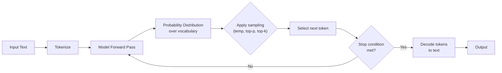
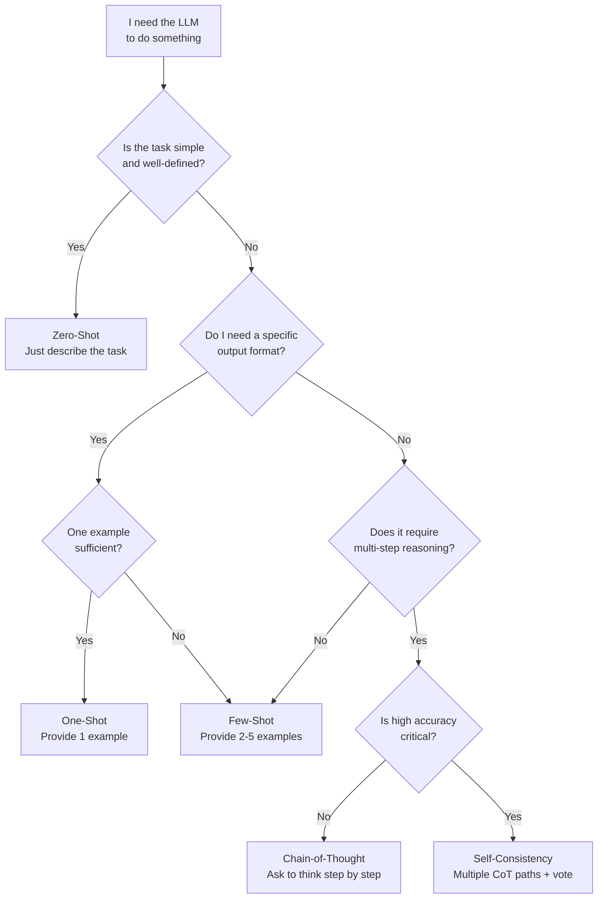
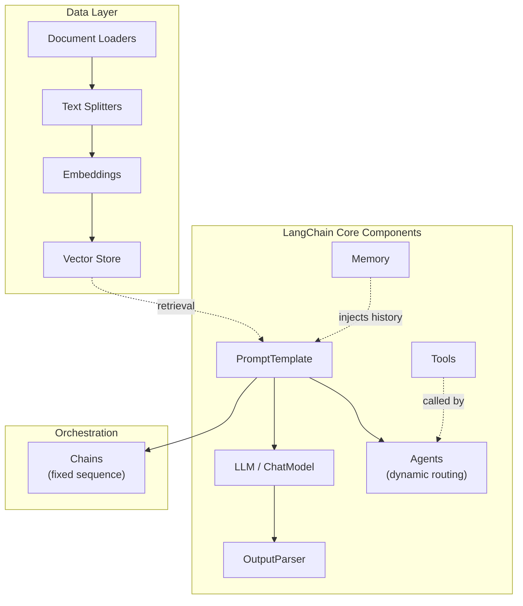
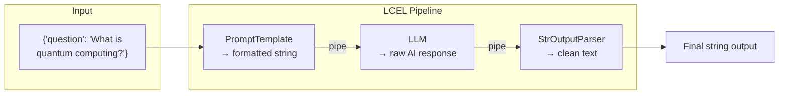
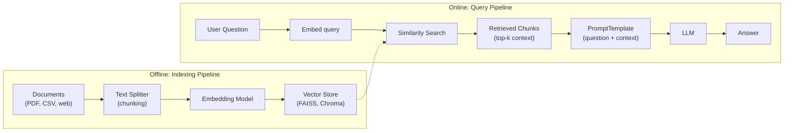
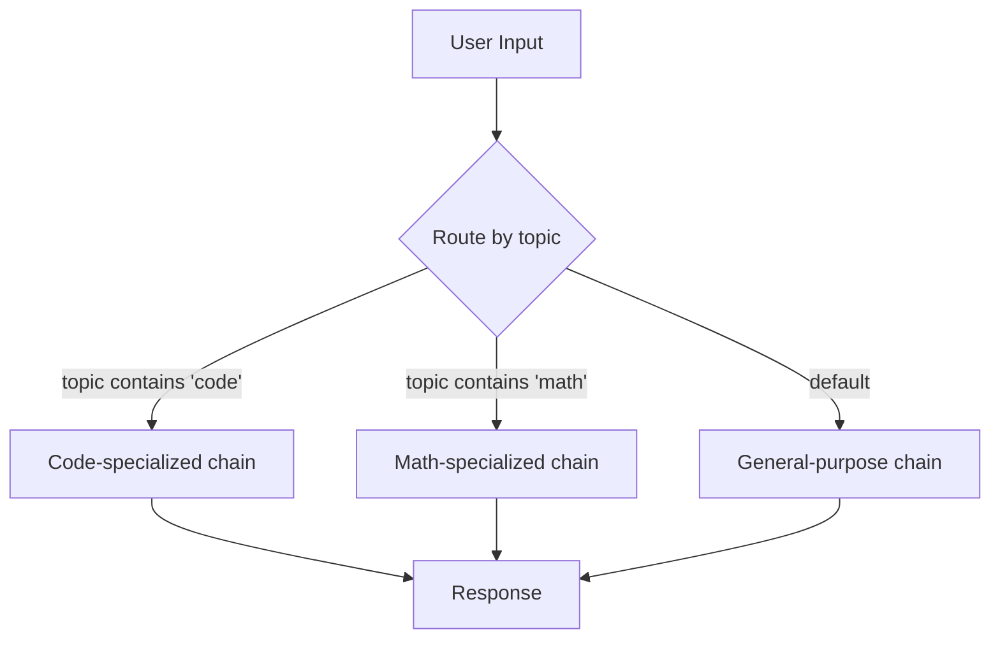
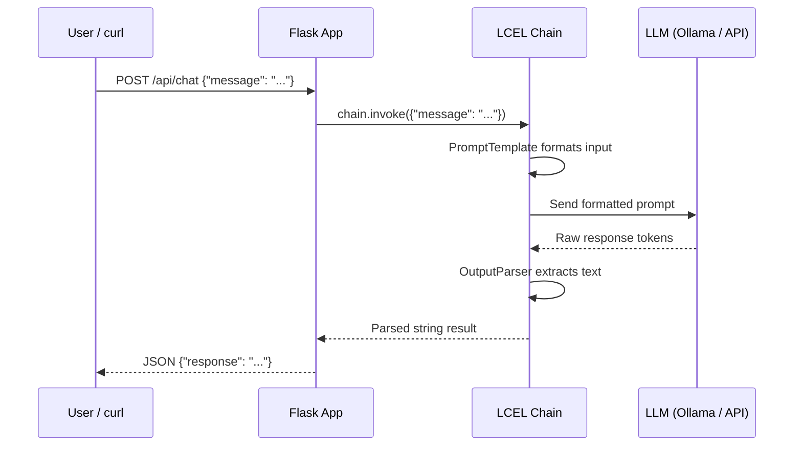
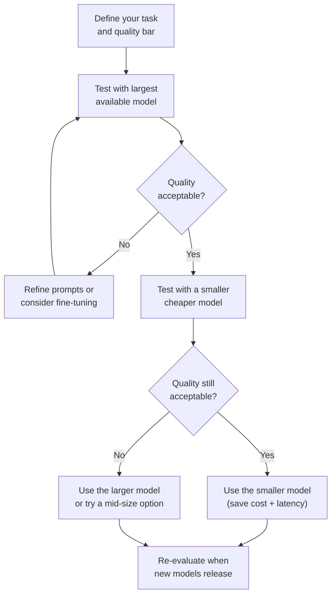
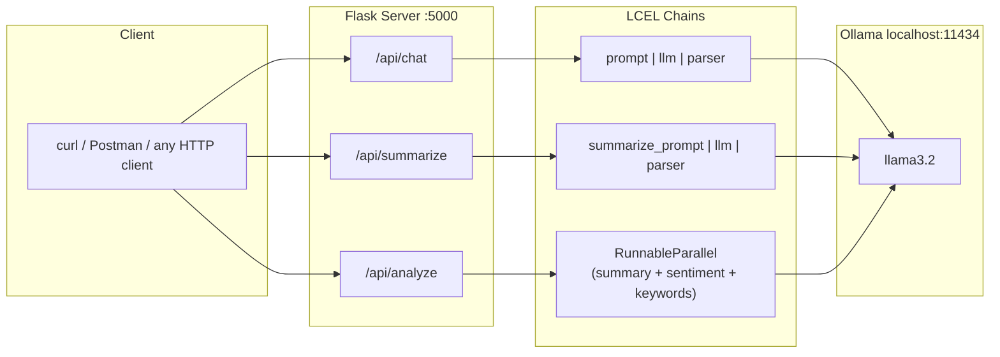

# Develop Generative AI Applications: Get Started

> **Course:** IBM on Coursera | **Level:** Intermediate | **Duration:** ~9 hours
>
> **Prerequisites:** Working knowledge of Python and basic AI/Web development
>
> **Curriculum:** 3 Modules — 16 videos, 7 readings, 7 assignments (labs + graded quizzes)

---

## Table of Contents

- [Module 1: Foundations of Generative AI & Prompt Engineering](#module-1-foundations-of-generative-ai--prompt-engineering)
  - [1.1 Core Definitions](#11-core-definitions)
    - [Generative vs. Discriminative AI](#generative-vs-discriminative-ai)
      - [The Probability Notation — Decoded](#the-probability-notation--decoded)
      - [Discriminative Models — Learning P(Y|X)](#discriminative-models--learning-pyx)
      - [Generative Models — Learning P(X) or P(X|Y)](#generative-models--learning-px-or-pxy)
      - [Generative Models Can Also Classify (via Bayes' Theorem)](#generative-models-can-also-classify-via-bayes-theorem)
      - [Side-by-Side Summary](#side-by-side-summary)
    - [Foundation Models](#foundation-models)
    - [Large Language Models (LLMs)](#large-language-models-llms)
    - [How an LLM Generates Text — Visual Flow](#how-an-llm-generates-text--visual-flow)
  - [1.2 Natural Language Processing (NLP) Tools](#12-natural-language-processing-nlp-tools)
    - [Tokenization](#tokenization)
    - [Stemming](#stemming)
    - [Lemmatization](#lemmatization)
    - [Part of Speech (POS) Tagging](#part-of-speech-pos-tagging)
    - [Named Entity Recognition (NER)](#named-entity-recognition-ner)
  - [1.3 Prompt Engineering Techniques](#13-prompt-engineering-techniques)
    - [Zero-Shot Prompting](#zero-shot-prompting)
    - [One-Shot Prompting](#one-shot-prompting)
    - [Few-Shot Prompting](#few-shot-prompting)
    - [Chain-of-Thought (CoT) Prompting](#chain-of-thought-cot-prompting)
    - [Self-Consistency](#self-consistency)
    - [Which Prompting Technique Should I Use?](#which-prompting-technique-should-i-use)
- [Module 2: The LangChain Framework & LCEL](#module-2-the-langchain-framework--lcel)
  - [2.1 LangChain Core Components](#21-langchain-core-components)
    - [Chains](#chains)
    - [Agents](#agents)
    - [Memory](#memory)
    - [Output Parsers](#output-parsers)
    - [Prompt Templates](#prompt-templates)
  - [2.2 LangChain Expression Language (LCEL)](#22-langchain-expression-language-lcel)
    - [Why LCEL over Legacy Chains?](#why-lcel-over-legacy-chains)
    - [Building an LCEL Chain — Step by Step](#building-an-lcel-chain--step-by-step)
    - [Composition Primitives](#composition-primitives)
    - [Type Coercion](#type-coercion)
  - [2.3 The LangChain Ecosystem: Beyond the Basics](#23-the-langchain-ecosystem-beyond-the-basics)
    - [Why LangChain Over Raw API Calls?](#why-langchain-over-raw-api-calls)
    - [Document Loaders](#document-loaders)
    - [Text Splitters](#text-splitters)
    - [Vector Stores & Embeddings](#vector-stores--embeddings)
    - [RAG — Retrieval-Augmented Generation](#rag--retrieval-augmented-generation)
  - [2.4 Advanced LCEL Patterns](#24-advanced-lcel-patterns)
    - [RunnablePassthrough — Forwarding Input](#runnablepassthrough--forwarding-input)
    - [RunnableBranch — Conditional Routing](#runnablebranch--conditional-routing)
    - [Fallbacks — Graceful Degradation](#fallbacks--graceful-degradation)
    - [Streaming — Token-by-Token Output](#streaming--token-by-token-output)
    - [Batch Processing — Throughput](#batch-processing--throughput)
    - [LCEL Methods at a Glance](#lcel-methods-at-a-glance)
- [Module 3: Full-Stack Development & Model Selection](#module-3-full-stack-development--model-selection)
  - [3.1 Web Development with Flask](#31-web-development-with-flask)
    - [Core Concepts](#core-concepts)
    - [Typical Flask + LangChain Architecture](#typical-flask--langchain-architecture)
  - [3.2 Model Selection Criteria](#32-model-selection-criteria)
    - [Key Evaluation Factors](#key-evaluation-factors)
    - [The "Large-to-Small" Strategy](#the-large-to-small-strategy)
    - [Key Models Referenced in the Course](#key-models-referenced-in-the-course)
- [Hands-On: Flask + LCEL Demo](#hands-on-flask--lcel-demo)
- [Quick Reference: Technical Cheat Sheet](#quick-reference-technical-cheat-sheet)
- [Key Takeaways](#key-takeaways)

---

## Module 1: Foundations of Generative AI & Prompt Engineering

### 1.1 Core Definitions

#### Generative vs. Discriminative AI

These are two fundamentally different paradigms in machine learning. The distinction is rooted in *what probability* each type of model learns to estimate.

##### The Probability Notation — Decoded

Before the comparison, let's lock down the notation since everything flows from it:

- **X** = the input data (an image, a block of text, an email, a patient's medical record — whatever you feed the model).
- **Y** = the label or class (spam/not-spam, cat/dog, positive/negative sentiment — the answer you want).
- **P(...)** = "the probability of ..." — a number between 0 and 1 expressing how likely something is.
- **P(A|B)** = "the probability of A *given that* B is true" — a **conditional probability**. The bar `|` means "given" or "conditioned on."

##### Discriminative Models — Learning P(Y|X)

A discriminative model learns **P(Y|X)**: *"Given this input X, what is the probability of each possible label Y?"*

It draws a **decision boundary** in the feature space that separates one class from another. It doesn't care *why* the data looks the way it does — it only cares about telling classes apart.

**Concrete example — spam detection:**

You have an email (X). The model outputs:

```
P(Y=spam  | X) = 0.92   ← 92% chance it's spam
P(Y=ham   | X) = 0.08   ← 8% chance it's legitimate
```

The model picks the highest probability: **spam**. It never learned what a "typical spam email" looks like as a whole — it just learned which features (words, patterns) push the probability toward spam vs. not-spam.

**Common discriminative models:** Logistic Regression, SVMs, Random Forests, standard Neural Network classifiers, BERT (for classification tasks).

**What it's good at:** Classification and prediction tasks where you have labeled data and just need an answer.

**What it can't do:** Generate new emails, create images, or produce anything — it only assigns labels.

##### Generative Models — Learning P(X) or P(X|Y)

A generative model learns the **full probability distribution of the data itself**. There are two flavors:

**Flavor 1 — P(X): Unconditional generation**

*"What does the data look like in general?"*

The model learns the statistical structure of all training data. Once it understands that structure, it can **sample from it** to create new, realistic instances.

```
Training data: 100,000 photos of human faces
Learned: P(X) — the distribution of pixel values that make a "realistic face"
Generation: Sample from P(X) → produces a brand-new face that never existed
```

This is how models like GANs (Generative Adversarial Networks) and VAEs (Variational Autoencoders) work.

**Flavor 2 — P(X|Y): Conditional generation**

*"What does the data look like given a specific condition/label Y?"*

```
Y = "a sunset over the ocean, oil painting style"
P(X | Y) → generates an image matching that description
```

This is how text-to-image models (Stable Diffusion, DALL-E) and instruction-following LLMs work. The condition Y is your prompt, and the model generates data X that's consistent with it.

**How LLMs fit in:** An autoregressive LLM like GPT models $P(x_1, x_2, ..., x_n)$ — the joint probability of a sequence of tokens. It decomposes this using the **chain rule of probability**:

$$P(x_1, x_2, ..., x_n) = P(x_1) \times P(x_2|x_1) \times P(x_3|x_1, x_2) \times ... \times P(x_n|x_1, ..., x_{n-1})$$

In plain English: the model predicts one token at a time, where each prediction is conditioned on everything that came before it. When you see an LLM "writing" text, it's repeatedly asking *"given everything so far, what's the most likely next token?"* and sampling from that distribution.

##### Generative Models Can Also Classify (via Bayes' Theorem)

Here's an important nuance: because a generative model learns P(X|Y) and P(Y), it can *derive* the discriminative probability P(Y|X) using **Bayes' Theorem**:

$$P(Y|X) = \frac{P(X|Y) \times P(Y)}{P(X)}$$

Where:
- **P(X|Y)** = likelihood — how probable is this data given this class? (learned by the generative model)
- **P(Y)** = prior — how common is this class in general? (estimated from training data)
- **P(X)** = evidence — how probable is this data overall? (a normalizing constant)

So a generative model can classify *and* generate. A discriminative model can only classify. The tradeoff is that discriminative models are usually **more accurate at classification** because they focus all their capacity on that one task, while generative models spread capacity across learning the entire data distribution.

##### Side-by-Side Summary

| Aspect | Discriminative AI | Generative AI |
|---|---|---|
| **Learns** | P(Y\|X) — boundary between classes | P(X) or P(X\|Y) — the data distribution itself |
| **Question it answers** | "What label does this input get?" | "What does data that looks like this label/prompt look like?" |
| **Can classify?** | Yes (directly) | Yes (indirectly, via Bayes' theorem) |
| **Can generate new data?** | No | Yes — this is its primary strength |
| **Accuracy on classification** | Typically higher (focused objective) | Typically lower (broader objective) |
| **Output** | A label or score | Novel content (text, images, code, audio, video) |
| **Examples** | Logistic Regression, SVM, BERT (classifier) | GPT, Llama, Stable Diffusion, GANs, VAEs |

**The intuitive analogy:**

A discriminative model looks at a photo and says *"that's an egg."* It learned to draw a line between "egg" and "not egg" in feature space.

A generative model takes the concept of "egg" and *draws a nest with three eggs in a sunlit meadow* — because it learned what eggs, nests, and meadows look like as data distributions and can sample new instances from them.

#### Foundation Models

Foundation models are large-scale AI models pre-trained on massive, diverse datasets using self-supervised learning. The key insight is **transfer learning** — instead of training a model from scratch for every task, you train one powerful base model and then adapt (fine-tune) it for downstream tasks like summarization, translation, question-answering, or code generation.

**Why this matters:** Before foundation models, every NLP task required its own separately trained model. Foundation models changed this by providing a single, general-purpose starting point that can be specialized cheaply.

Notable foundation models:

- **GPT-4 / GPT-4o** (OpenAI) — strong general-purpose reasoning and multimodal capabilities
- **Llama 3** (Meta) — open-weight model family, strong at reasoning tasks
- **IBM Granite** — enterprise-focused, designed for business applications with emphasis on trust and governance
- **Mixtral** (Mistral AI) — uses a Mixture-of-Experts (MoE) architecture for efficiency
- **Claude** (Anthropic) — emphasis on safety and helpfulness

#### Large Language Models (LLMs)

LLMs are a specific category of foundation models trained on terabytes of unstructured text. They learn statistical patterns in language — which words tend to follow which — at such scale that they develop emergent capabilities like reasoning, in-context learning, and code generation.

**How they work at a high level:**

1. **Pre-training:** The model ingests billions of tokens and is trained with a single objective: **predict the next token**. The loss function is the negative log-likelihood of the correct next token, averaged over the entire training corpus. Despite this simple objective, the model is forced to learn grammar, world knowledge, reasoning patterns, and more — because accurately predicting the next word in *any* context requires deep understanding.

2. **Fine-tuning (optional):** The base model is further trained on curated datasets for specific tasks or behaviors. Supervised fine-tuning (SFT) uses (instruction, response) pairs to teach the model to follow instructions rather than just complete text.

3. **Alignment (RLHF/DPO):** Human feedback is used to align the model's outputs with human preferences. In RLHF, a **reward model** is trained on human preference rankings, then the LLM is optimized (via PPO) to maximize that reward. DPO (Direct Preference Optimization) skips the reward model and optimizes preferences directly — simpler and increasingly popular.

**Key generation parameters and the math behind them:**

When an LLM generates text, at each step it produces a probability distribution over its entire vocabulary (e.g., 32,000 tokens). The parameters below control *how* the next token is sampled from that distribution.

- **Temperature (T):** Rescales the raw logits before converting them to probabilities via softmax. The math:

  $$P(token_i) = \frac{e^{z_i / T}}{\sum_j e^{z_j / T}}$$

  Where $z_i$ is the raw logit for token *i*. When T → 0, the distribution becomes a spike on the highest-logit token (greedy/deterministic). When T → ∞, all tokens become equally likely (random noise). Practical range: 0.0–1.0. Use low T (0.0–0.3) for factual/code tasks, higher T (0.7–1.0) for creative writing.

- **Top-p (nucleus sampling):** Instead of sampling from the full vocabulary, sort tokens by probability, then keep only the smallest set of tokens whose cumulative probability ≥ p. This dynamically adjusts the candidate pool — when the model is confident, few tokens pass the threshold; when uncertain, more do. Typical value: 0.9–0.95.

- **Top-k:** A simpler alternative — keep only the top *k* most probable tokens and redistribute probability among them. Less adaptive than top-p.

- **Max tokens:** Hard cap on the number of tokens the model will generate in a single response. Does not affect quality — just prevents runaway generation.

- **Stop sequences:** Strings (e.g., `"\n\n"`, `"User:"`) that tell the model to halt generation when encountered. Useful for controlling output boundaries in multi-turn or structured scenarios.

#### How an LLM Generates Text — Visual Flow



---

### 1.2 Natural Language Processing (NLP) Tools

NLP is a toolkit for converting unstructured human language into structured data a computer can process. These techniques predate LLMs but remain foundational for understanding how language processing works.

#### Tokenization

Breaking text into discrete units (tokens) that the model can process.

```python
from nltk.tokenize import word_tokenize

text = "The quick brown fox jumps over the lazy dog."
tokens = word_tokenize(text)
# ['The', 'quick', 'brown', 'fox', 'jumps', 'over', 'the', 'lazy', 'dog', '.']
```

**Modern LLMs use subword tokenization** (like Byte-Pair Encoding or SentencePiece) rather than simple word splitting. This allows them to handle unknown words by breaking them into known subword pieces (e.g., "unhappiness" → "un", "happiness").

#### Stemming

A rule-based approach that chops off prefixes/suffixes to approximate a word's root form. It's fast but crude — it doesn't always produce real words.

```python
from nltk.stem import PorterStemmer

stemmer = PorterStemmer()
words = ["running", "ran", "runner", "runs"]
stems = [stemmer.stem(w) for w in words]
# ['run', 'ran', 'runner', 'run']
```

#### Lemmatization

A dictionary-based approach that maps words to their true root form (lemma). More accurate than stemming but slower.

```python
from nltk.stem import WordNetLemmatizer

lemmatizer = WordNetLemmatizer()
print(lemmatizer.lemmatize("better", pos="a"))  # "good"
print(lemmatizer.lemmatize("running", pos="v"))  # "run"
```

**Stemming vs. Lemmatization:** Stemming is like cutting with scissors (fast but imprecise). Lemmatization is like looking up a dictionary (slower but always returns a real word).

#### Part of Speech (POS) Tagging

Identifies the grammatical role of each word based on its context in a sentence. The same word can have different POS tags depending on usage:

- *"I **make** dinner"* → `make` is a **verb**
- *"What **make** is your laptop?"* → `make` is a **noun**

#### Named Entity Recognition (NER)

Identifies and classifies named entities in text into predefined categories:

- **PERSON:** "Elon Musk" → Person
- **ORG:** "IBM" → Organization
- **GPE:** "Arizona" → Geopolitical Entity (U.S. State)
- **DATE:** "March 2026" → Date
- **MONEY:** "$500" → Monetary Value

NER is critical for information extraction pipelines, search engines, and chatbots that need to understand *what* a user is referring to.

---

### 1.3 Prompt Engineering Techniques

Prompt engineering is the art and science of designing inputs to guide an LLM toward a desired output. It's the primary way developers interact with and control LLM behavior without retraining.

#### Zero-Shot Prompting

The model receives only the task description — no examples. This tests the model's pre-trained knowledge.

```text
Classify the following statement as true or false:
"The Eiffel Tower is in Berlin."

→ False. The Eiffel Tower is in Paris, France.
```

**When to use:** Simple, well-defined tasks where the model's training data likely covers the domain.

#### One-Shot Prompting

Provides exactly one example to establish the expected format and behavior.

```text
Translate English to French:
English: "Good morning" → French: "Bonjour"

English: "How are you?" → French:
```

**When to use:** When you need to show the model a specific output format or style.

#### Few-Shot Prompting

Provides 2–5 examples to help the model generalize a pattern.

```text
Classify the emotion in each statement:
"I just got promoted!" → Joy
"My flight was cancelled again." → Frustration
"I miss my grandmother." → Sadness

"I can't believe I won the lottery!" →
```

**When to use:** Tasks where format, tone, or classification logic needs to be demonstrated with multiple cases. More examples generally improve consistency.

#### Chain-of-Thought (CoT) Prompting

Guides the model to reason step-by-step instead of jumping to an answer. This dramatically improves performance on math, logic, and multi-step reasoning tasks.

```text
Q: A store sells apples for $2 each. If I buy 5 apples and pay with a $20 bill,
how much change do I receive?

A: Let's think step by step.
1. Cost of 5 apples = 5 × $2 = $10
2. Change = $20 - $10 = $10
The answer is $10.
```

**Why it works:** By forcing the model to "show its work," intermediate reasoning steps reduce the chance of errors that come from trying to compute the final answer in one leap.

#### Self-Consistency

An enhancement to CoT prompting: generate multiple independent reasoning paths for the same problem, then take a majority vote on the final answer.

```text
Path 1: ... → Answer: $10
Path 2: ... → Answer: $10
Path 3: ... → Answer: $12 (arithmetic error)

Majority vote → $10 ✓
```

**When to use:** High-stakes or complex reasoning tasks where a single chain-of-thought might contain errors.

#### Which Prompting Technique Should I Use?



---

## Module 2: The LangChain Framework & LCEL

### 2.1 LangChain Core Components

[LangChain](https://www.langchain.com/) is an open-source framework that modularizes the development of LLM-powered applications by providing composable building blocks. It abstracts common patterns so you don't have to reinvent them for every project.



#### Chains

A chain is a sequence of calls where the output of one step becomes the input for the next. This is the most fundamental pattern in LangChain.

**Example — Recipe Chain:**

```
Step 1: "What is a famous dish from Tokyo?" → "Ramen"
Step 2: "Give me a recipe for Ramen." → [recipe text]
Step 3: "Estimate the cooking time for this recipe." → "45 minutes"
```

Each step feeds into the next, creating a pipeline from a simple question to a rich, multi-part answer.

#### Agents

Agents are dynamic systems where the LLM itself decides which tools to call, in what order, and with what arguments. Unlike chains (which have a fixed sequence), agents reason about the best course of action at each step.

**How agents work:**

1. The LLM receives the user's question plus a description of available tools.
2. It decides which tool to call (e.g., a web search, a calculator, a database query).
3. It observes the tool's output and decides whether to call another tool or return a final answer.

```python
from langchain.agents import create_pandas_dataframe_agent

agent = create_pandas_dataframe_agent(llm, df, verbose=True)
agent.invoke("How many rows are in the data?")
# Agent internally generates: df.shape[0] → returns "There are 1,500 rows."
```

**Common tool types:** Web search, SQL databases, Python REPL, APIs, vector stores, calculators.

#### Memory

By default, each LLM call is stateless — the model has no memory of previous interactions. LangChain's memory components solve this by storing and injecting conversation history.

```python
from langchain.memory import ChatMessageHistory

history = ChatMessageHistory()
history.add_user_message("My name is Ashik.")
history.add_ai_message("Nice to meet you, Ashik!")
history.add_user_message("What is my name?")
# The AI can now answer "Your name is Ashik" because the history is passed as context
```

**Memory types:**

| Type | Description |
|---|---|
| **ConversationBufferMemory** | Stores the entire conversation verbatim |
| **ConversationSummaryMemory** | Uses an LLM to summarize older messages, keeping context compact |
| **ConversationBufferWindowMemory** | Keeps only the last `k` message exchanges |
| **ConversationTokenBufferMemory** | Keeps messages up to a max token count |

#### Output Parsers

Transform raw LLM text output into structured formats like JSON, XML, CSV, or Pydantic models. This is critical for integrating LLM outputs into downstream applications.

```python
from langchain.output_parsers import StructuredOutputParser, ResponseSchema

schemas = [
    ResponseSchema(name="answer", description="The answer to the question"),
    ResponseSchema(name="confidence", description="Confidence level: high, medium, low"),
]
parser = StructuredOutputParser.from_response_schemas(schemas)
```

#### Prompt Templates

Reusable prompt structures with placeholders that get filled at runtime.

```python
from langchain.prompts import PromptTemplate

template = PromptTemplate.from_template(
    "Tell me a {adjective} joke about {content}"
)
prompt = template.format(adjective="funny", content="chickens")
# "Tell me a funny joke about chickens"
```

---

### 2.2 LangChain Expression Language (LCEL)

LCEL is the modern, recommended way to build LangChain applications. It uses the **pipe operator (`|`)** to connect components into readable, declarative pipelines — similar to Unix pipes or functional composition.

#### Why LCEL over Legacy Chains?

| Feature | Legacy Chains | LCEL |
|---|---|---|
| **Syntax** | Verbose, class-based | Clean pipe operator (`\|`) |
| **Streaming** | Limited support | First-class streaming |
| **Async** | Requires separate implementation | Built-in async support |
| **Parallelism** | Manual | Native `RunnableParallel` |
| **Tracing/Debugging** | Basic | Automatic LangSmith integration |

#### Building an LCEL Chain — Step by Step

**Step 1: Define a prompt template**

```python
from langchain.prompts import PromptTemplate

template = PromptTemplate.from_template(
    "You are a helpful assistant. Answer the following question: {question}"
)
```

**Step 2: Set up your LLM**

```python
from langchain_ibm import WatsonxLLM

llm = WatsonxLLM(
    model_id="ibm/granite-3-2-8b-instruct",
    url="https://us-south.ml.cloud.ibm.com",
    project_id="your-project-id",
    params={"max_new_tokens": 256, "temperature": 0.7},
)
```

**Step 3: Add an output parser**

```python
from langchain.schema.output_parser import StrOutputParser

parser = StrOutputParser()
```

**Step 4: Chain them together with the pipe operator**

```python
chain = template | llm | parser
result = chain.invoke({"question": "What is quantum computing?"})
print(result)
```

The data flows left to right: the template formats the prompt → the LLM generates a response → the parser extracts clean text.



#### Composition Primitives

**RunnableSequence** — Components execute one after another:

```python
from langchain.schema.runnable import RunnableLambda

def add_exclamation(text):
    return text + "!"

chain = template | llm | parser | RunnableLambda(add_exclamation)
```

**RunnableParallel** — Multiple tasks run concurrently on the same input:

```python
from langchain.schema.runnable import RunnableParallel

parallel_chain = RunnableParallel(
    summary=summary_chain,
    translation=translation_chain,
    sentiment=sentiment_chain,
)

results = parallel_chain.invoke({"text": "LangChain is a powerful framework."})
# results["summary"], results["translation"], results["sentiment"]
```

A single input text is passed to three parallel tasks simultaneously, returning a dictionary of results.

#### Type Coercion

LCEL automatically converts common Python types behind the scenes:

- **Functions** → `RunnableLambda` (any callable becomes a pipeline step)
- **Dictionaries** → `RunnableParallel` (each key-value pair runs concurrently)

This means you can write cleaner code without explicit wrapping:

```python
chain = template | llm | {
    "uppercase": lambda x: x.upper(),
    "word_count": lambda x: len(x.split()),
}
```

---

### 2.3 The LangChain Ecosystem: Beyond the Basics

LangChain is more than chains and prompts — it's an ecosystem of tools for the entire lifecycle of an LLM application: loading data, chunking it, storing embeddings, retrieving context, and generating responses. This section covers the pieces you need to build production-grade systems.

#### Why LangChain Over Raw API Calls?

You *can* call the OpenAI or Ollama API directly with `requests`. So why use a framework?

| Problem | Raw API Calls | LangChain Solution |
|---|---|---|
| **Provider lock-in** | Your code is tightly coupled to one API's format | Swap `ChatOllama` for `ChatOpenAI` — same chain works |
| **Composability** | Manual glue code for multi-step workflows | Pipe operator chains components declaratively |
| **Observability** | `print()` debugging | LangSmith tracing, automatic logging |
| **Common patterns** | Rewrite RAG, agents, memory from scratch every time | Pre-built abstractions tested by the community |
| **Streaming** | Implement SSE/chunked responses yourself | `.stream()` works out of the box |

LangChain earns its complexity when your application goes beyond a single prompt/response — when you need retrieval, multi-step reasoning, tool use, or provider flexibility.

#### Document Loaders

Document loaders ingest data from various sources into LangChain's `Document` format (text + metadata).

```python
from langchain_community.document_loaders import (
    PyPDFLoader,
    CSVLoader,
    WebBaseLoader,
    TextLoader,
)

pdf_docs = PyPDFLoader("report.pdf").load()
csv_docs = CSVLoader("data.csv").load()
web_docs = WebBaseLoader("https://example.com/article").load()
txt_docs = TextLoader("notes.txt").load()
```

Each loader returns a list of `Document` objects with `.page_content` (the text) and `.metadata` (source, page number, etc.). There are 100+ loaders for Notion, Slack, Google Drive, databases, and more.

#### Text Splitters

Raw documents are usually too long to fit in a model's context window. Text splitters break them into manageable chunks while preserving semantic coherence.

```python
from langchain.text_splitter import RecursiveCharacterTextSplitter

splitter = RecursiveCharacterTextSplitter(
    chunk_size=1000,
    chunk_overlap=200,
    separators=["\n\n", "\n", ". ", " ", ""],
)

chunks = splitter.split_documents(pdf_docs)
```

**Why `RecursiveCharacterTextSplitter`?** It tries to split on paragraph breaks first, then sentences, then words — preserving natural boundaries rather than cutting mid-sentence. The `chunk_overlap` ensures context isn't lost at boundaries.

#### Vector Stores & Embeddings

To retrieve relevant chunks at query time, you convert text into **embeddings** (dense numerical vectors) and store them in a **vector store** that supports similarity search.

```python
from langchain_community.embeddings import OllamaEmbeddings
from langchain_community.vectorstores import FAISS

embeddings = OllamaEmbeddings(model="llama3.2")

vectorstore = FAISS.from_documents(chunks, embeddings)

retriever = vectorstore.as_retriever(search_kwargs={"k": 4})
```

When a user asks a question, their query is also embedded, and the vector store returns the `k` most similar chunks — giving the LLM targeted context instead of the entire document.

#### RAG — Retrieval-Augmented Generation

RAG is the pattern that ties it all together: **retrieve** relevant context from your data, then **generate** a response grounded in that context. This is how you make an LLM "know" about your private documents without fine-tuning.



**Full RAG chain in LCEL:**

```python
from langchain_core.prompts import ChatPromptTemplate
from langchain_core.runnables import RunnablePassthrough
from langchain_core.output_parsers import StrOutputParser

rag_prompt = ChatPromptTemplate.from_messages([
    ("system",
     "Answer the question based only on the following context:\n\n"
     "{context}\n\n"
     "If the answer is not in the context, say 'I don't know'."),
    ("human", "{question}"),
])

def format_docs(docs):
    return "\n\n".join(doc.page_content for doc in docs)

rag_chain = (
    {"context": retriever | format_docs, "question": RunnablePassthrough()}
    | rag_prompt
    | llm
    | StrOutputParser()
)

answer = rag_chain.invoke("What were Q3 revenue numbers?")
```

This single chain: retrieves relevant chunks → formats them as context → injects them into the prompt → sends to the LLM → parses the output. All declarative, all composable.

---

### 2.4 Advanced LCEL Patterns

Beyond basic pipes, LCEL provides primitives for real-world complexity: passing data through unchanged, conditional routing, fallback models, streaming, and batch processing.

#### RunnablePassthrough — Forwarding Input

Sometimes you need the original input alongside a transformed version. `RunnablePassthrough` passes data through unchanged while other branches transform it.

```python
from langchain_core.runnables import RunnablePassthrough, RunnableParallel

chain = RunnableParallel(
    context=retriever | format_docs,
    question=RunnablePassthrough(),
)

result = chain.invoke("What is LCEL?")
# result = {"context": "...retrieved text...", "question": "What is LCEL?"}
```

This is the backbone of every RAG chain — you need both the retrieved context *and* the original question to build the final prompt.

#### RunnableBranch — Conditional Routing

Route input to different chains based on conditions. Think of it as an `if/elif/else` for pipelines.

```python
from langchain_core.runnables import RunnableBranch

branch = RunnableBranch(
    (lambda x: "code" in x["topic"], code_chain),
    (lambda x: "math" in x["topic"], math_chain),
    general_chain,  # default fallback
)

result = branch.invoke({"topic": "code", "question": "Write a sort function"})
```



#### Fallbacks — Graceful Degradation

If your primary model fails (rate limit, timeout, error), automatically fall back to a backup.

```python
from langchain_ollama import ChatOllama

primary = ChatOllama(model="llama3.2")
backup = ChatOllama(model="mistral")

reliable_llm = primary.with_fallbacks([backup])

chain = prompt | reliable_llm | parser
```

If `llama3.2` throws an exception, LCEL transparently retries with `mistral`. You can chain multiple fallbacks in priority order.

#### Streaming — Token-by-Token Output

For user-facing applications, waiting for the full response feels slow. Streaming delivers tokens as they're generated.

```python
for chunk in chain.stream({"question": "Tell me about black holes"}):
    print(chunk, end="", flush=True)
```

Every LCEL chain supports `.stream()` automatically. The output is an iterator that yields partial results — the same way ChatGPT's UI shows text appearing word by word.

#### Batch Processing — Throughput

Process multiple inputs concurrently for higher throughput.

```python
questions = [
    {"question": "What is gravity?"},
    {"question": "What is photosynthesis?"},
    {"question": "What is entropy?"},
]

results = chain.batch(questions, config={"max_concurrency": 3})
```

`.batch()` runs all inputs through the chain in parallel (up to `max_concurrency`), returning a list of results. Essential for data processing pipelines, evaluation scripts, and bulk operations.

#### LCEL Methods at a Glance

| Method | What It Does | Use Case |
|---|---|---|
| `.invoke(input)` | Run once, return full result | Single request |
| `.stream(input)` | Yield tokens as generated | Real-time UIs |
| `.batch(inputs)` | Run many inputs in parallel | Data pipelines |
| `.ainvoke(input)` | Async version of invoke | Async web servers |
| `.astream(input)` | Async streaming | Async real-time UIs |

---

## Module 3: Full-Stack Development & Model Selection

### 3.1 Web Development with Flask

Flask is a lightweight (micro) web framework used to build the user-facing interface for GenAI applications. It handles HTTP requests, serves HTML pages, and connects the frontend to your LLM backend logic.

#### Core Concepts

**Routing** — Maps URLs to Python functions using decorators:

```python
from flask import Flask, render_template, request

app = Flask(__name__)

@app.route("/")
def home():
    return render_template("index.html")

@app.route("/generate", methods=["POST"])
def generate():
    user_input = request.form["prompt"]
    result = chain.invoke({"question": user_input})
    return render_template("result.html", output=result)
```

**Jinja2 Templating** — Embeds dynamic Python data into HTML:

```html
<h1>AI Response</h1>
<p>{{ output }}</p>


    <div class="result-card">{{ output }}</div>

    <p>No response generated.</p>

```

**HTTP Status Codes:**

| Code | Meaning | When It Happens |
|---|---|---|
| `200` | OK | Request succeeded |
| `201` | Created | Resource successfully created |
| `400` | Bad Request | Client sent invalid data |
| `404` | Not Found | The requested URL doesn't exist |
| `500` | Internal Server Error | Something broke on the server side |

#### Typical Flask + LangChain Architecture



1. User sends a request (browser form, curl, frontend app).
2. Flask receives it, passes the input to an LCEL chain.
3. The chain processes it through prompt template → LLM → output parser.
4. Flask returns the result as JSON or renders it in an HTML template.

---

### 3.2 Model Selection Criteria

Choosing the right model is not a one-time decision — it's an ongoing evaluation process. Think of it as "tending a garden" where conditions (cost, performance needs, new model releases) change over time.

#### Key Evaluation Factors

| Factor | Considerations |
|---|---|
| **Model Size** | Smaller models (SLMs, 1–8B params) have lower latency and cost. Larger models (70B+) handle complex reasoning better. |
| **Performance** | Benchmark scores (MMLU, HumanEval, etc.) give a rough comparison, but always test on *your* specific use case. |
| **Cost** | API-based services charge per token. Self-hosting requires GPU infrastructure. The tradeoff is operational complexity vs. per-call cost. |
| **Latency** | Time-to-first-token and tokens-per-second matter for real-time applications. Smaller models are generally faster. |
| **Guardrails & Safety** | What data was it trained on? Does it have content filters? Is it compliant with your organization's policies? |
| **Licensing** | Open-weight (Llama, Granite) vs. proprietary (GPT-4). Open-weight gives you more control but more responsibility. |

#### The "Large-to-Small" Strategy

A practical approach to model selection:

1. **Start large:** Test your use case with the most capable model available (e.g., GPT-4, Llama 3 70B). Establish a quality baseline.
2. **Evaluate smaller alternatives:** Try to replicate the results with a smaller, cheaper model (e.g., Granite 8B, Llama 3 8B).
3. **Compare:** If the smaller model produces acceptable quality for your use case, use it — you save significantly on cost and latency.
4. **Iterate:** As new models release, re-evaluate periodically.



#### Key Models Referenced in the Course

| Model | Developer | Architecture | Strengths |
|---|---|---|---|
| **Llama 3** | Meta | Dense Transformer | Strong reasoning, open-weight, large community |
| **IBM Granite** | IBM | Dense Transformer | Enterprise-grade, governance-focused, multi-language |
| **Mixtral** | Mistral AI | Mixture of Experts (MoE) | Efficient inference — only activates a subset of parameters per token |

---

## Hands-On: Flask + LCEL Demo

Theory is only half the picture. The `demos/flask_lcel_demo/` folder contains a working Flask API that you can run locally and test with `curl`. It demonstrates three LCEL patterns against a local Ollama model — no cloud API keys required.



### Quick Start

```bash
# 1. Pull a model (one-time, ~2GB)
ollama pull llama3.2

# 2. Install dependencies
cd demos/flask_lcel_demo
pip install -r requirements.txt

# 3. Run the server
python app.py
```

### Try It

```bash
# Basic chat — sequential chain
curl -s -X POST http://localhost:5000/api/chat \
  -H "Content-Type: application/json" \
  -d '{"message": "What is LCEL in 2 sentences?"}' | python -m json.tool

# Summarize — constrained prompt template
curl -s -X POST http://localhost:5000/api/summarize \
  -H "Content-Type: application/json" \
  -d '{"text": "LangChain is an open-source framework..."}' | python -m json.tool

# Analyze — RunnableParallel (3 chains at once)
curl -s -X POST http://localhost:5000/api/analyze \
  -H "Content-Type: application/json" \
  -d '{"text": "The product launch exceeded expectations."}' | python -m json.tool
```

| Endpoint | LCEL Pattern | What It Teaches |
|---|---|---|
| `/api/chat` | `prompt \| llm \| parser` | Basic sequential chain |
| `/api/summarize` | `prompt \| llm \| parser` | Prompt engineering (constrained output format) |
| `/api/analyze` | `RunnableParallel(...)` | Parallel execution with shared input |

> Full details, configuration options, and sample responses are in [`demos/flask_lcel_demo/README.md`](../demos/flask_lcel_demo/README.md).

---

## Quick Reference: Technical Cheat Sheet

| Task | Code |
|---|---|
| **Install libraries** | `pip install ibm-watsonx-ai langchain langchain-ibm flask` |
| **Create a prompt template** | `prompt = PromptTemplate.from_template("Tell me a {adj} joke about {topic}")` |
| **Build an LCEL chain** | `chain = prompt \| llm \| StrOutputParser()` |
| **Invoke a chain** | `chain.invoke({"adj": "funny", "topic": "cats"})` |
| **Start a Flask app** | `app = Flask(__name__)` then `app.run(debug=True)` |
| **Initialize Watsonx LLM** | `WatsonxLLM(model_id="ibm/granite-3-2-8b-instruct", url=..., project_id=...)` |
| **Add memory** | `ChatMessageHistory()` with `.add_user_message()` / `.add_ai_message()` |
| **Run parallel tasks** | `RunnableParallel(summary=chain1, translation=chain2)` |

---

## Key Takeaways

1. **Generative AI creates; Discriminative AI classifies.** Understanding this distinction — and the math behind it — is foundational.
2. **Prompt engineering is your primary lever** for controlling LLM behavior without retraining. Use the decision tree above to pick the right technique.
3. **LangChain is an ecosystem**, not just a chain builder. Document loaders, text splitters, vector stores, and retrievers form the data backbone; chains and agents form the orchestration layer.
4. **RAG is the most important pattern** for production LLM apps. It lets models answer questions about *your* data without fine-tuning.
5. **LCEL is the modern standard** for composing LangChain pipelines. Master `.invoke()`, `.stream()`, `.batch()`, `RunnableParallel`, and `RunnableBranch` — they cover 95% of use cases.
6. **Flask bridges AI and users** — the demo in `demos/flask_lcel_demo/` proves you can go from zero to a working API in under 50 lines.
7. **Model selection is iterative** — start large, shrink to the smallest model that meets your quality bar, and re-evaluate when new models drop.
